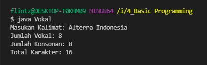
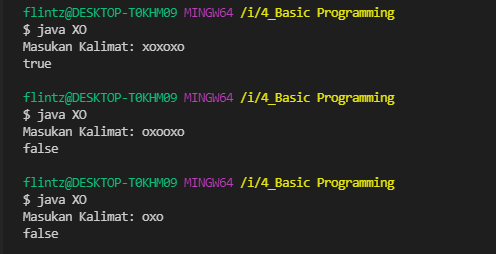
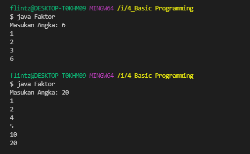
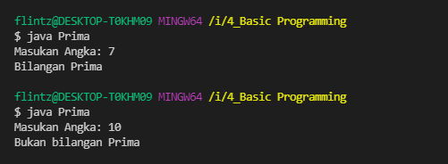
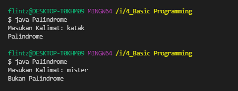
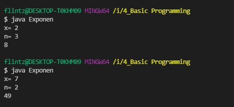
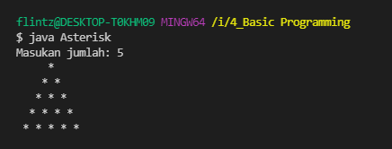
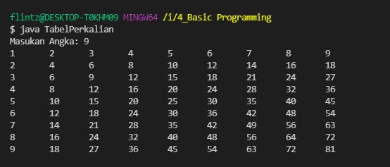

# (4) Basic Programming

## Resume
Dalam materi ini, mempelajari:
1. Tools untuk Java
2. Type Data
3. Variable
4. Primitive & Non Primitive
5. Array
6. Operator
7. Input Output
8. Branching
9. Looping
10. Method
11. Komentar

### Tools untuk Java
Pada Java diperlukan **JDK** untuk mengembangkan aplikasi dan melakukan kompilasi pada java, IDE bisa menggunakan **Intelij IDEA**

### Type Data
- Integer (byte, short, int, long)
- Decimal (float, double)
- Boolean
- Char
- String

### Variable
Variable adalah tempat yang memiliki nama dan dapat menampung data.

```
int angka;
var nama = "hendro";
```

### Array
Merupakan sebuah variable yang menyimpan lebih dari 1, dan index dimulai dari 0
```
char[] alterra = new char[] {'a','l','t','e','r','r','a'};
char[] alterra = new char[7];
alterra[0] = 'a';
alterra[1] = 'l';
alterra[2] = 't';
alterra[3] = 'e';
alterra[4] = 'r';
alterra[5] = 'r';
alterra[6] = 'a';

```
### Operator
- Assignment (=)
- Arithmetic (+,-,*,/,%)
- Unary (+,-,++,--,!)
- Equality dan Relational (==,!=,>,>=,<,<=)
- Conditional (&&, ||)

### Input Output
Input bisa berasal dari Keyboard dan output berupa console.

```
import java.util.Scanner;

class Input {
    public static void main(String[] args) {
        Scanner input = new Scanner(System.in);

        System.out.print("Masukan angka: ");
        int number = input.nextInt();
        System.out.println("angka: " + number);

        input.close();
    }
}
```
### Branching
Merupakan Percabangan jika ada kondisi tertentu dalam suatu program
- If-Then
- If-Then-Else
- Switch

### Looping
Perulangan merupakan aktifitas yang dapat dilakukan berulang dan dapat ditentukan batasan mulai dan akhir
- For
- While
- Do-While
- Foreach
- Break & Continue

### Method
Merupakan bagian yang berisi code yang dapat dijalankan ketika method tersebut dipanggil.

```
public class Tambah {
    public static void main(String[] args) {
        System.out.println(tambah(1,2));
    }
    
    public static int tambah(int a, int b) {
        return a + b ;
    }
}
```

### Komentar
Komentar digunakan untuk memberi catatan tambahan untuk dimengerti dan komentar tidak akan dijalankan.


## Task
Mengimplementasikan materi dasar bahasa java dengan membuat Program dengan menerima input dan menghasilkan sebuah output
### 1. Vokal, Konsonan
Pada task ini, menghitung jumlah karakter yang berupa vokal, konsonan, dan total karakter dari "Alterra Indonesia"


[Task 1](./praktikum/Vokal.java)\
output:\


### 2. X dan O
Pada task ini, Program menerima satu variabel string, dan menghasilkan output true jika jumlah karakter X sama dengan O, dan false jika tidak


[Task 2](./praktikum/XO.java)\
output:\


### 3. Faktor Bilangan
Pada task ini, membuat sebuah program untuk menampilkan faktor sebuah bilangan.


[Task 3](./praktikum/Faktor.java)\
output:\


### 4. Bilangan Prima
Pada task ini, membuat sebuah fungsi untuk menentukan sebuah bilangan prima atau tidak


[Task 4](./praktikum/Prima.java)\
output:\


### 5. Palindrome
Pada task ini, mendeteksi sebuah string merupakan palindrome atau tidak


[Task 5](./praktikum/Palindrome.java)\
output:\


### 6. Exponentation
Pada task ini, membuat sebuah fungsi untuk menghitung nilai pangkat


[Task 6](./praktikum/Exponen.java)\
output:\


### 7. Play With Asterisk
Pada task ini, membuat program untuk mencetak segitiga asterik


[Task 7](./praktikum/Asterisk.java)\
output:\


### 8. Cetak Tabel Perkalian
Pada task ini, memunculkan output sebuah tabel perkalian


[Task 8](./praktikum/TabelPerkalian.java)\
output:\



