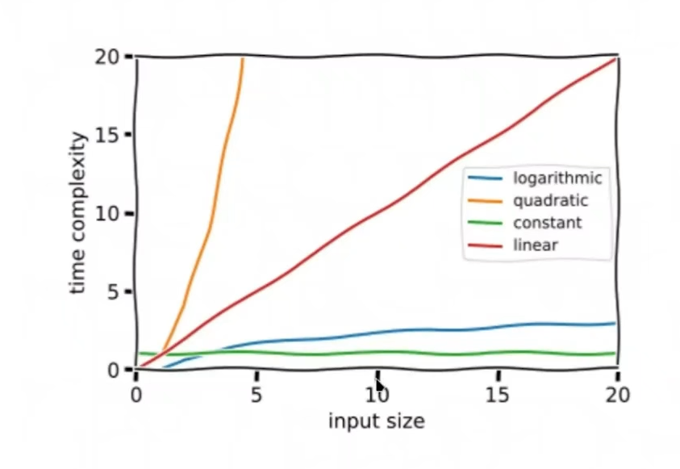
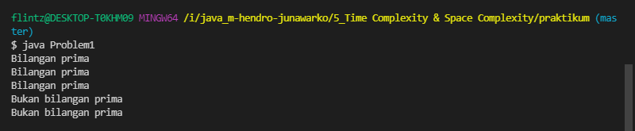
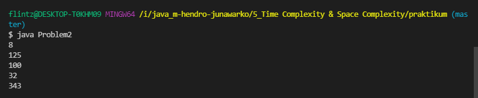

# (5) Time Complexity & Space Complexity

## Resume
Dalam materi ini, mempelajari:
1. Time Complexity
2. Constant time
3. Linear time
4. Logarithmic time
5. Quadratic time

### Time Complexity
Time Complexity adalah seberapa lama waktu operasi yang diperlukan untuk menjalankan suatu program. Dapat dilihat 
#### Constant time - O(1)
Biasanya tidak ada proses berulang, proses dilakukan hanya sekali
```
public static int constants(int result) {
        result += 10;
        return result;
    }
```
#### Linear time - O(n)
Proses perulangan dari awal hingga nilai n 
```
public static int linear(int n) {
        int result = 0;
        for (int i = 0; i < n; i++) {
            if (result == -1) {
                return result;
            }
        }
        result += 10;
        return result;
    }
```
#### Logarithmic time - O(log n)
Proses perulangan hinggan n dan nilai n berkurang berdasarkan faktor
```
public static int linear(int n) {
        int result = 0;
        while (n > 1) {
            n /= 2;
            result += 1;
        }
        return result;
    }
```

#### Quadratic time - O(n^2)
proses perulangan dari awal hingga nilai n dan perulangan menjadi bertingkat
```
 public static int linear(int n) {
        int result = 0;
        for (int i = 0; i < n; i++) {
            for (int j = i; j < n; j++) {
                result +=1;
            }
        }
        return result;
    }
```

#### Grafik perbandingan dari Time Complexity



## Task
### 1. Problem 1 - Bilangan Prima 
Pada task ini, menentukan bilangan prima dengan Time Complexity 

[Problem 1](./praktikum/Problem1.java)\
output:\


### 2. Problem 2 - Fast Exponentiation 
Pada task ini, menentukan bilangan Eksponen dengan Time Complexity 

[Problem 2](./praktikum/Problem2.java)\
output:\



