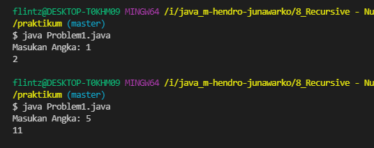
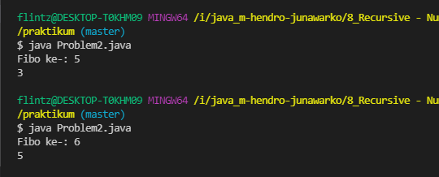
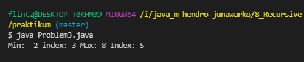
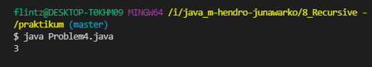

# (8) Recursive - Number Theory - Sorting and Searching

## Resume
Dalam materi ini, mempelajari:
1. Recursive
2. Number Theory
3. Searching
4. Sorting

### Recursive
Merupakan situasi saat membuat sebuah fungsi yang memanggil fungsi itu sendiri.
- Rekursif membantu mempersingkat dan solusi pada kode.
- Sesuatu yang berulang  cenderung kompleks untuk dipikirkan

#### Example Problem: Factorial
```
 public static int factorial(int n) {
        if (n == 1) {
            return 1;
        } else {
            return n * factorial(n - 1);
        }

    }
```
### Number Theory
Adalah cabang dari matematika yang membahas angka. Contoh Prima, FPB, KPK, Faktorial.
#### Prime Number
```
static boolean checkPrime(int number) {
        if (number < 2) {
            return false;
        }
        int sqrtNumber = (int) Math.sqrt(number);
        for (int i = 2; i <= sqrt.number; i++) {
            if (number % i == 0) {
                return false;
            }
        }
        return true;
    }
```
#### GCD
```
static int gcd(int a, int b) {
        if (b == 0) {
            return a;
        }
        return gcd(b, a % b);

    }
```

#### LCM
```
static int lcm(int a, int b) {
        return a * (b / gcd(a, b));
    }
```

### Searching
Searching adalah Proses yang bertujuan menemukan sebuah data dari kumpulan data.
#### Linier search - O(n)
```
static int linierSearch(int[] elements, int x) {
        for (int i = 0; i < elements.length; i++) {
            if (elements[i] == x) {
                return i;
            }
        }
        return -1;
    }
```
#### Builtins search
```
static int builtIn(int[] elements, int x) {
        return Arrays.binarySearch(elements, x);
    }
```
### Sorting
Sorting adalah proses menyusun data sesuai dengan urutannya. Dapat mengurutkan angka maupun huruf. Dari terkecil ke terbesar atau sebaliknya

#### Selection sort - O(n^2)
Membandingkan suatu nilai data dengan lainnya 
```
static int[] selectionSort(int[] elements) {
        int n = elements.length;
        for (int i = 0; i < n; i++) {
            int minimal = i;
            for (int j = i + 1; j < n; j++) {
                if (elements[j] < elements[minimal]) {
                    minimal = j;
                }
            }
            int tmp = elements[i];
            elements[i] = elements[minimal];
            elements[minimal] = tmp;

        }
        return elements;
    }
```
#### Counting sort - O(n+k)
Menghitung berapa kali data tersebut muncul dalam array tersebut
```
static int[] coutningSort(int[] e, int k) {
        int[] count = new int[k + 1];
        for (int i = 0; i < e.length; i++) {
            count[e[i]]++;
        }
        int counter = 0;
        for (int i = 0; i < k + 1; i++) {
            for (int j = 0; j < count[i]; j++) {
                e[counter] = i;
                counter++;
            }
        }
        return e;
    }
```
####  Builtins Sort in Java
Sorting yang sudah terdapat pada bahasa java
```
static int[] builtinSort(int[] elements) {
        Arrays.sort(elements);
        return elements;
    }
```

## Task
### 1. Problem 1 - Prima ke X (Tanpa Recursive) 
Pada task ini, menampilkan bilangan prima sesuai dengan indexnya 

[Problem 1](./praktikum/Problem1.java)\
output:\


### 2. Problem 2 - Fibonacci (Recursive)
Pada task ini, menampilkan bilangan Fibonacci ke-n 

[Problem 2](./praktikum/Problem2.java)\
output:\


### 3. Problem 3 - Find Min and Max Number
Pada task ini, mencari bilangan terkecil dan terbesar pada array dan juga menampilkan index tersebut. tidak boleh melakukan pengurutan terhadap array

[Problem 3](./praktikum/Problem3.java)\
output:\


### 4. Problem 4 - Maximum Buy Product
Pada task ini, membeli barang dengan jumlah maksimum uang yang dimiliki

[Problem 4](./praktikum/Problem4.java)\
output:\


### 5. 
Pada task ini,  

[Problem 5](./praktikum/Problem5.java)\
output:\


