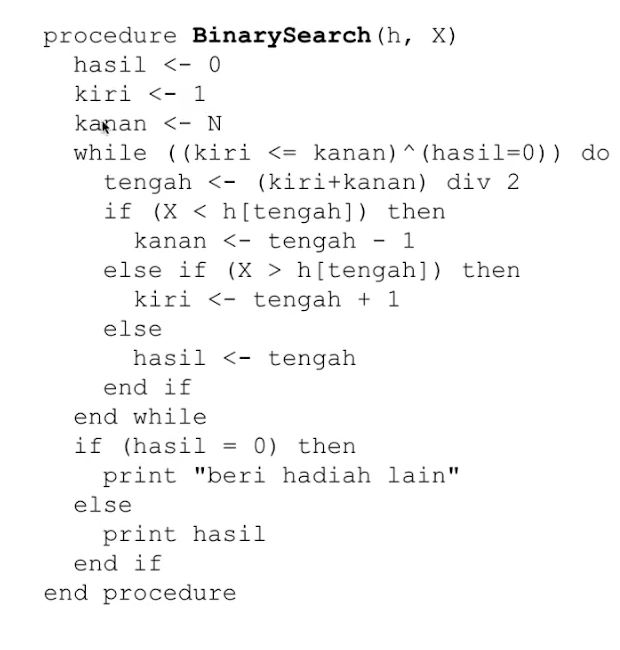
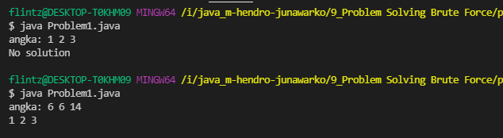
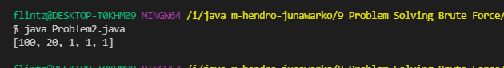
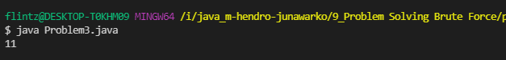
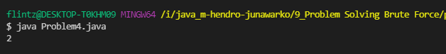

# (9) Problem Solving Brute Force


## Resume
Dalam materi ini, mempelajari:
1. Complete Search (Brute Force) 
2. Divide & Conquer
3. Greedy


### Problem Solving Paradigm
Adalah bagaimana menyelesaikan sebuah masalah dengan beberapa prinsip seperti **Complete search**, **Divide and Conquer**, **Greedy**

### Complete Search
Bisa dikenal Bruteforce adalah menyelesaikan masalah dengan cara melakukan sebuah pengecekan semua data. mudah digunakan karna dijalankan searah, bruteforce dapat menyelesaikan masalah namun tidak mementingkan waktu.
#### Example: Find Max and Min
```
// mencari nilai max dan min pada array
findMaxMin([10, 7, 3, 5, 8 ,2, 9])  //  max=10, min=2
```

### Divide & Conquer
Menyelesaikan masalah menjadi kelompok lebih kecil bisa dibagi 2 lalu menjadi lebih kecil lagi dan akan mendapatkan solusinya
#### Example: Binary Search
```
// mencari angka 3 pada array dan kembalikan nilai indexnya
binarySearch([1,1,3,5,5,6,7], 3)  // index=2
```

### Greedy
Menyelesaikan masalah dengan mencari nilai lokal optimal 
#### Example: Coin Change
diberikan list koin={10, 25, 5, 1} 
```
// mencari kombinasi terkecil yang jika dijumlahkan sesuai dengan jumlah yang diinputkan
coinChange(42) // 25 10 5 1 1
```


## Task
### 1. Problem 1 - Simple Equations 
Pada task ini, menghitung nilai dari x, y, z dengan kombinasi \
x + y + z = A\
x * y * z = B\
x^2 + y^2 + z^2 = C\


[Problem 1](./praktikum/Problem1.java)\
output:\


### 2. Problem 2 - Money Change
Pada task ini, menukar uang yang diberikan menjadi pecahan kecil.
PecahanUang: {1, 10, 20, 50, 100, 200, 500, 1000, 2000, 5000, 10000}
Tampilkan hasil penukaran paling optimal dengan jumlah minimum

[Problem 2](./praktikum/Problem2.java)\
output:\


### 3. Problem 3 - Dragon of Loowater 
Pada task ini, diberikan diameter kepala tiap naga dan  tinggi tiap prajurit.
setiap prajurit hanya bisa memotong 1 naga dan tinggi prajurit harus lebih atau sama dengan diameter kepala naga,  jika bisa memotong semua tampilkan jumlah minimum dari tinggi prajurit dan jika tidak tampilkan "knight fall"


[Problem 3](./praktikum/Problem3.java)\
output:\


### 4. Problem 4 - Binary Search Algorithm
Pada task ini,  mencari data pada array yang sudah terurut dengan menggunakan binary search dengan dibagi menjadi 2 dengan menyimpan nilai awal, akhir dan tengah. 


[Problem 4](./praktikum/Problem4.java)\
output:\

