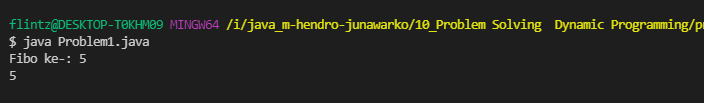
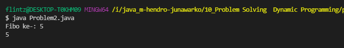
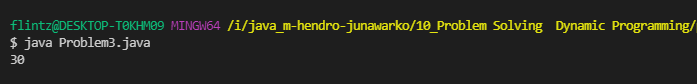
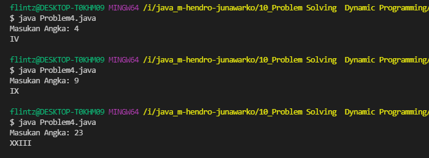

# (10) Problem Solving : Dynamic Programming

## Resume
Dalam materi ini, mempelajari:
1. Dynamic Programming
2. Characteristic of Dynamic Programming
3. Dynamic Programming Method


### Dynamic Programming
Merupakan algoritma untuk menyelesaikan masalah secara optimal menjadi ke dalam masalah yang lebih mudah dikerjakan
#### Example: Fibonacci Number
```
// mencari nilai fibo ke-n
Fib(n) = Fib(n - 1) + Fib(n - 2), for n > 1
```

### Characteristic of Dynamic Programming
#### Overlapping Subproblems
Ketika mencari solusi subproblem akan dipanggil beberapa kali, sehingga kita tau bahwa problem dilakukan berkali-kali, bisa digambarkan dengan tree

#### Optimal Substructure Property
Setiap problem harus optimal dari setiap fungsinya.

### Dynamic Programming Method

#### Top-down with Memoization
Memecahkan masalah dengan recursive sampai menjadi sub problem yang kecil.
#### Bottom-up with Tabulation
Menghindari recursive, dengan menyesaikan masalah nilai terkecil dahulu.


## Task
### 1. Problem 1 - Fibonacci Number Top-down 
Pada task ini, menampilkan bilangan Fibonacci ke-n


[Problem 1](./praktikum/Problem1.java)\
output:\


### 2. Problem 2 - Fibonacci Number Bottom-up 
Pada task ini, menampilkan bilangan Fibonacci ke-n sama


[Problem 2](./praktikum/Problem2.java)\
output:\


### 3. Problem 3 - Frog
Pada task ini, 


[Problem 3](./praktikum/Problem3.java)\
output:\


### 4. Problem 4 - Roman Numerals 
Pada task ini, mengkonversi dari angka normal ke huruf romawi


[Problem 4](./praktikum/Problem4.java)\
output:\


