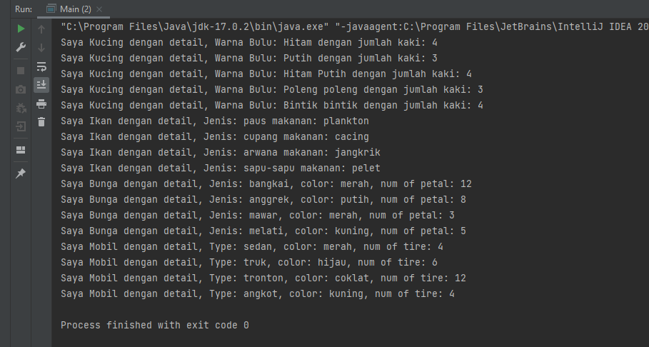
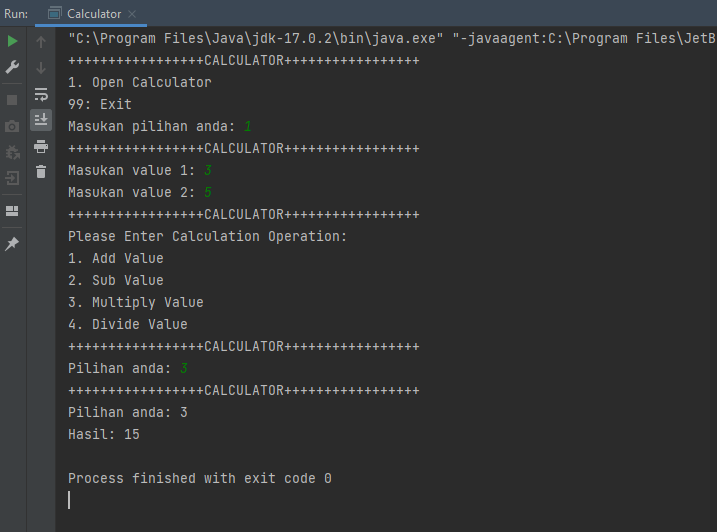
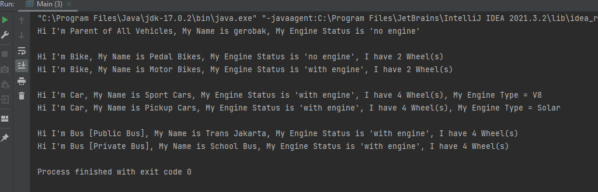
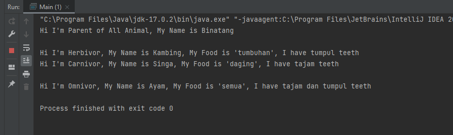
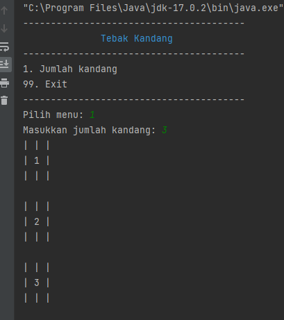
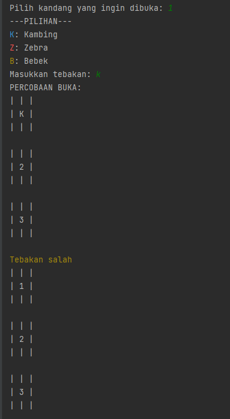
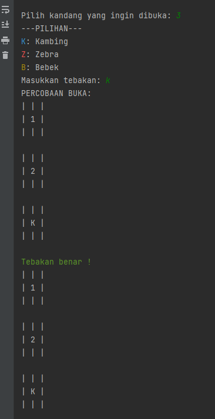
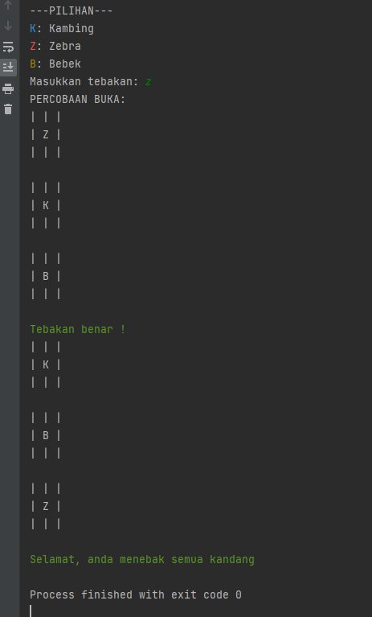

# (11&12) Generic and OOP Part 1 & Part2

## Resume
Dalam materi ini, mempelajari:
1. Encapsulation
2. Data Abstraction
3. Inheritance
4. Polymorphism

### Encapsulation

Proses dimana object dibuat yang mempunyai attribute dan behavior (Properties dan Method) tersembunyi dari luar
#### Class
Merupakan template/blueprint yang digunakan  untuk membuat object
#### Attributes Type
- Public (dapat diakses dimana saja)
- Protected (dapat diakses di class dan package yang sama) 
- Private (hanya dapat diakses di class yang sama )


```
public class Dog {
    private String name;
    private String color;

    public Dog(String name, String Color) {
        this.name = name;
        this.color = color;
    }

    public String getName() {
        return this.name;
    }

    public static void main(String[] args) {
        Dog dog = new Dog("Peter", "Red");
        dog.getName();
    }
}

```

### Data Abstraction
Object yang sangat umum bisa disebut data abstraction yang dibelakang proses tidak diketahui 
#### Setter & Getter
Getter untuk mengambil data field, Setter untuk mengubah data field.
```
public interface AC {
    void nyalakanKipas();
}

public class DaikinAC implements AC {
    @Override
    void nyalakanKipas() {
        System.out.println("Mode Hangat");
    }
}

public class GreeAC implements AC {
    @Override
    void nyalakanKipas() {
        System.out.println("Mode Dingin Brrr");
    }
}
```


### Inheritance
Inheritance adalah kemampuan yang dapat mewariskan atau menurunkan sifatnya, dari sebuah class ke class lain, biasa disebut parent dan child

```
public class ChildDog extends Dog {
    super(String name, String color);
}
```

### Polymorphism
Adalah kemampuan sebuah object berubah bentuk menjadi bentuk lain, erat hubungannya dengan magic inheritance
```
public interface Vehicle {
    void forward();
    void reverse();
}

Public

class Avanza implements Vehicle {
    @Override
    void forward() {
        System.out.println("50 km/h");
    }

    @Override
    void reverse() {
        System.out.println("20 km/h");
    }
}Public

class Ayla implements Vehicle {
    @Override
    void forward() {
        System.out.println("20 km/h");
    }

    @Override
    void reverse() {
        System.out.println("10 km/h");
    }
}

```


## Task
### 1. Challenge 1 - Encapsulation
Pada task ini,  mendefinisikan pembuatan class dengan menggunakan konsep encapsulation, tampilkan hasil output


[Challenge 1 ](./praktikum/Challenge1/)\
output:\


### 2. Challenge 2 - Data Abstraction
Pada task ini,  membuat aplikasi calculator dengan fungsi penjumlahan, pengurangan, perkalian dan pembagian.


[Challenge 2 ](./praktikum/Challenge2)\
output:\


### 3. Challenge 3 - Inheritance & Polymorphism (Vehicles)
Pada task ini,  menampilkan output dari implementasi Inheritance & Polymorphism pada contoh class Vehicles


[Challenge 3 ](./praktikum/Challenge3)\
output:\



### 4. Challenge 4 - Inheritance & Polymorphism (Animals)
Pada task ini,  menampilkan output dari implementasi Inheritance & Polymorphism pada contoh class Animals


[Challenge 4 ](./praktikum/Challenge4)\
output:\



### 5. Challenge 5 - Tebak Kandang
Pada task ini,  membuat game tebak kandang dengan materi OOP yang sudah dipelajari (Encapsulation, Data Abstraction, Inheritance, Polymorphism)


[Challenge 5 ](./praktikum/Challenge5)\
output:\
menu:\
\
tebakan salah:\
\
tebakan benar:\
\
semua benar:\
\