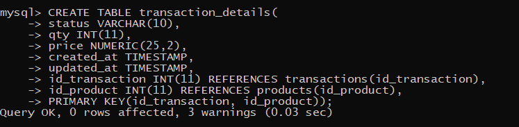
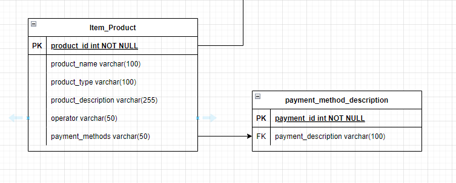

# (13) Database Schema - DDL - DML Join - Union - Agregasi - Subquery - Function (DBMS)

## Resume
Dalam materi ini, mempelajari:
1. Database Schema
2. Database Relationship
3. RDBMS
4. SQL


### Database
merupakan sebuah kumpulan data yang terorganisir yang tersimpan dalam sistem komputer

### Database Relationship
Database Relationship adalah sebuah hubungan entity dalam database.
- One to One
- One to Many
- Many to Many

### Entity Relationship Diagram
Diagram yang digunakan untuk perancangan database 


|  | department |       
| --- | --- |       
| pk  | id   |
| 	  | name |

|  | employee |       
| --- | --- |       
| pk  | id   |
| 	  | name |
| 	  | phone |
| fk  | department_id |

### RDBMS
Adalah sebuah aplikasi untuk melakukan manajemen sistem

### SQL
SQL Structured Query Language adalah bahasa pemrograman yang digunakan untuk manajemen sebuah data

### DDL
Data Definition Language Perintah digunakan untuk mengubah dan menghapus struktur dan definisi skema database.

#### DDL Statement

```
SHOW DATABASES;
CREATE DATABASE database_name;
USE database_name;
CREATE TABLE ...
DROP TABLE ...
RENAME TABLE ...
```

```
// membuat table
CREATE TABLE user(
    id INT NOT NULL AUTO_INCREMENT PRIMARY KEY,
    name VARCHAR(100),
    email CARCHAR(255));

```

```
// memodifikasi table
ALTER TABLE user
ADD COLUMN password VARCHAR(255);

```


### DML
Data Manipulation Language perintah yang digunakan untuk mengakses dan memodifikasi data padadatabase.

#### Statement Operation
- INSERT
```
INSERT INTO user (username, name, email, password, address)
VALUES('alterra', 'AlterraAcademy', 'alterra@gmail.com', '123, 'malang');
```
- SELECT
```
SELECT * FROM user;

// dengan kondisi
SELECT * FROM user WHERE id=1;
```
- UPDATE 
```
UPDATE user
SET name = 'hendro'
WHERE id=1;
```
- DELETE
```
DELETE FROM user WHERE id=1;
```

#### DML Statement
- LIKE / BETWEEN
```
SELECT * FROM user WHERE name LIKE '%Alterra%';

SELECT * FROM user WHERE id BETWEEN 3 AND 10;
```
- AND / OR
- ORDER BY
```
SELECT * FROM user ORDER BY name ASC;
```
- LIMIT
```
SELECT * FROM user LIMIT 3;
```


## Task
### 1. Implement the Schema (Digital Outlet Pulsa) 
Pada task ini, membuat schema database menggunakan draw.io 


[Task 1](./praktikum/Task.txt)\
output:\


### 2. Data Definition Language 
Pada task ini, mengimplementasikan schema tersebut menjadi tabel di MySQL menggunakan query di terminal.

[ Query.txt](./praktikum/query.txt)

1. Create database\
output:\


2. a. Create tabel user\
output:\
\
\
    b. Create tabel product\
output:\

\
Create tabel product type\
output:\

\
Create tabel operator\
output:\

\
Create tabel product description\
output:\

\
Create tabel payment methods\
output:\


    c. Create tabel transaction\
output:\

\
Create tabel transaction details\
output:\


3. Create tabel kurir\
output:\


4. menambahkan ongkos_dasar column di tabel kurir\
output:\


5. rename tabel kurir menjadi shipping\
output:\


6. Hapus tabel shipping\
output:\


7. menambahkan entity baru \
a. 1 to 1\
output:\
\
b. 1 to many\
output:\
\
a. many to many\
output:\


