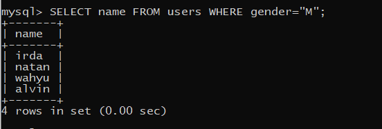
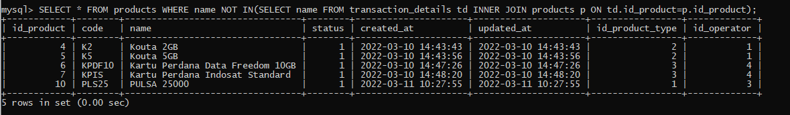

# (14) Join - Union - Agregasi - Subquery - Function (DBMS)

## Resume
Dalam materi ini, mempelajari:
1. Join
2. Union
3. Agregasi
4. Sub-query
5. Function

### Join
Adalah sebuah query untuk menggabungkan data tabel 1 dengan tabel yang lain atau lebih

- Inner Join
Inner Join akan menampilkan 2 tabel atau lebih
```
SELECT t.message FROM users u INNER JOIN tweets t ON u.id = t.user_id;
```
- Left Join
Left Join akan menampilkan seluruh data tabel yang ada disebelah kiri
- Right Join
Right Join akan menampilkan seluruh data tabel yang ada disebelah kanan

### Union
Menggabungkan data 1 dengan lainnya, dengan syarat jumlah field harus sama
```
SELECT username, fullname FROM users WHERE id=1 
UNION
SELECT username, fullname FROM users WHERE id=2
```

### Aggregate
Fungsi dimana nilai beberapa baris dikelompokkan bersama untuk membentuk nilai ringkasan tunggal.
- MIN
Untuk mendapatkan nilai minimum atau terkecil dari sebuah data 
```
SELECT MIN(id) AS id FROM users
```
- MAX
Untuk mendapatkan nilai maksimum atau terbesar dari sebuah data 
```
SELECT MAX(id) AS id FROM users
```
- SUM
Untuk mendapatkan jumlah total nilai dari sebuah data
```
SELECT SUM(favourite_count) 
FROM tweets WHERE user_id=1
```
- AVG
Untuk mencari nilai rata-rata dari sebuah data
```
SELECT AVG(favourite_count) 
FROM tweets WHERE user_id=1
```
- COUNT
Untuk mencari jumlah dari sebuah data
```
SELECT COUNT(1) 
FROM tweets WHERE user_id=1
```
- HAVING
Digunakan untuk menyeleksi data berdasarkan kriteria tertentu.
```
SELECT user_id FROM tweets 
GROUP BY user_id
HAVING SUM(favourite_count) > 2
```

### Sub-query
Adalah query didalam query SQL lain, digunakan untuk mengembalikan data yang akan digunakan dalam query utama sebagai syarat untuk lebih membatasi data yang akan diambil.

```
SELECT * FROM users WHERE id IN
(SELECT user_id FROM
tweets GROUP BY user_id);
```

### Function
Sebuah kumpulan statement yang akan mengembalikan sebuah nilai 
```
DELIMITER $$
CREATE FUNCTION sf_count_tweet_peruser (user_id_p int) RETURNS INT DETERMINISTIC
BEGIN
DECLARE total INT;
SELECT COUNT(*) INTO total FROM tweet WHERE user_id = user_id_p;
return total;
END $$
DELIMITER;
```

## Task
### 1. Problem 
Pada task ini, menerapkan Query menggunakan INSERT, SELECT, UPDATE, dan DELETE pada tugas sebelumnya\


[Query.txt ](./praktikum/Query.txt)

1. Insert

Insert 5 operators\
output:\
\
Insert 3 product type\
output:\
\
Insert 2 product\
output:\
\
Insert 3 product\
output:\
\
Insert 3 product\
output:\
\
Insert product description\
output:\
\
Insert 3 payment methods\
output:\
\
Insert 5 user\
output:\
\
Insert 3 transaksi\
output:\
\
Insert 3 product\
output:\


2. Select

Tampilkan nama user dengan gender M\
output:\
\
Tampilkan product dengan id = 3\
output:\
\
Tampilkan data user dengan range 7 hari dan mengandung kata 'a'\
output:\
\
Hitung jumlah user dengan gender perempuan\
output:\
\
Tampilkan data user sesuai abjad\
output:\
\
Tampilkan 5 data product\
output:\


3. Update

Ubah data product 1 dengan nama = 'product dummy'\
output:\
\
update qty = 3 pada transaction_details dengan product id = 1\
output:\
\

4. Delete

Delete data tabel product dengan id = 1\
output:\
\
Delete data tabel product dengan product type id = 1\
output:\
\

### 2. Join, Union, Sub-query, Function
Pada task ini, menerapkan Query menggunakan Join, Union, Sub-query, Function

[Query2.txt ](./praktikum/Query2.txt)

1. Gabungkan data transaksi dari user id 1 dan id 2\
output:\

2. Tampilkan jumlah harga transaksi user id 1\
output:\
\
3. Tampilkan total transaksi product type 2\
output:\

4. Tampilkan semua field product dan field name product type\
output:\

5. Tampilkan semua field transaction, field name product, field name user\
output:\

6. Membuat function data transaksi details dihapus saat data transaksi dihapus\
output:\
\
7. Membuat function update total_qty saat data transaksi details dihapus\
output:\
\
8. Tampilkan data product yang tidak ada di transaction details dengan sub-query\
output:\



