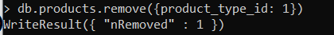

# (16) Introduction NoSQL and MongoDB 

## Resume
Dalam materi ini, mempelajari:
1. NoSQL Database
2. Tipe/Kategori

### Sejarah
1. First Round of Database Wars
2. Object Databases Challenge
3. Semi-structured

### NoSQL
Not only SQL, merupakan penyimpanan data yang tidak memiliki relasi\
Mekanisme yang lebih fleksibel menghindari:
- Kompleksitas SQL
- Design Schema diawal
- Transaction ditangani oleh aplikasi

#### Kelebihan NoSQL
1. Schema less
    - Tidak memiliki skema ketika menambahkan data
    - Aplikasi menangani proses validasi tipe data
    - Mendukung proses aggregasi dokumen pada item
2. Fast development
3. Support big size file
4. Support cluster

#### Kaidah CAP
- Consistency
Setiap proses baca mendapatkan data dari proses penulisan terakhir
- Availability
Setiap request mendapatkan respon yang bukan error
- Partition
DBMS tetap dapat beroperasi meskipun ada kesalahan jaringan

### Tipe/Kategori
1. Key/Value
    - Tipe yang paling simpel
    - Hash Table
    - Diakses menggunakan key
    - Use case: cache
2. Column - family
    - Penyimpanan data per-kolom
    - Use case: On-line Analytical Processing (OLAP)
3. Graph
    - Memodelkan struktur relasi dari data
    - Use case: Social network analysis
4. Document - based
    - Menyimpan informasi sebagai dokumen
    - Use case: Unstructured data: Logging

## Task
### 1. Problem 1: Create, Read, Update and Delete
Pada task ini, mengimplementasikan query pada MongoDB

[Query.txt ](./praktikum/Query.txt)

1. Create

a. Insert 5 operators\
output:\
\
b. Insert 3 product type\
output:\
\
c. Insert 2 product\
output:\
\
d. Insert 3 product\
output:\
\
e. Insert 3 product\
output:\
\
f. Insert product description\
output:\
\
g. Insert 3 payment methods\
output:\
\
h. Insert 5 user\
output:\
\
i. Insert 3 transaksi\
output:\
\
j. Insert 3 product\
output:\

2. Select

a. Tampilkan nama user dengan gender M\
output:\
\
b. Tampilkan product dengan id = 3\
output:\

c. Hitung jumlah user dengan gender perempuan\
output:\
\
d. Tampilkan data user sesuai abjad\
output:\
\
e. Tampilkan 5 data product\
output:\

3. Update

a. Ubah data product 1 dengan nama = 'product dummy'\
output:\
\
b. ubah qty = 3 pada transaction_details dengan product id = 1\
output:\

4. Delete

a. Delete data tabel product dengan id = 1\
output:\
\
b. Delete data tabel product dengan product type id = 1\
output:\

