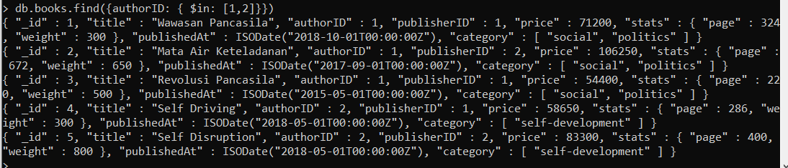
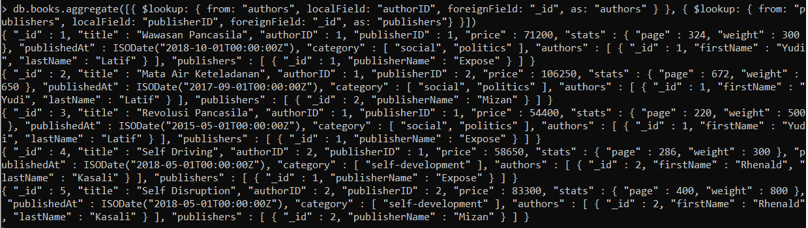

# (17) Introduction NoSQL & MongoDB 2

## Resume
Dalam materi ini, mempelajari:
1. MongoDB
2. Advanced Query, Array, Aggregation

### Instalasi
Cara install di Ubuntu
```
sudo apt install mongodb
```
Cara pastikan server sudah berfungsi
```
sudo netstat -plaNt --numeric-port | grep 27017
```
Cara menyalakan dan mematikan server
```
sudo service mongodb status|stop|start
```
### Administrasi
Ubah konfigurasi
```
sudo nano /etc/mongodb.conf
```

### Collection
Cara membuat db
```
use nama_db
```
Cara membuat collection (optional)
```
db.createCollection('mentees')
```

#### INSERT
```
db.mentees.insert({firstName: "Muhammad", lastName: "Hendro", gender: "male"})
```

#### Find-1
```
db.mentees.find()
db.mentees.find().pretty()
```

#### Update
```
// update dokumen
db.mentees.update({firstName: "Ahmad"}, {firstName: "Ahmad", lastName: "Mafaza", gender: "male"})

// $set
db.mentees.update({firstName: "Ahmad"}, { $set: { lastName: "Mafaza", age: 17}})

// $inc
db.mentees.update({firstName: "Ahmad"}, { $inc: { age: 1 }})

// $unset
db.mentees.update({firstName: "Ahmad"}, { $unset: { age: "" }})

// $rename
db.mentees.update({firstName: "Ahmad"}, { $rename: { gender: "sex" }})

// Upsert (update & insert)
db.mentees.update({firstName: "Danny"}, {firstName: "Danny"}, { upsert: true});

```

#### Remove
```
// hapus dokumen
db.mentees.remove({firstName: "Abdullah"});

// hapus 1 dokumen
db.mentees.remove({firstName: "Abdullah"}, { justOne: true});
```

#### Find-2
```
// find dengan parameter
db.mentees.find({firstName: "Abdullah"});

// find dokumen dalam dokumen
db.mentees.update({firstName: "Abdullah"}, { $set: { address: { street: "Tidar", city: "Malang" }}})
db.mentees.find({"address.city":"Malang"});

// tampilkan field spesifik
db.mentees.find({firstName: "Ahmad"}, {firstName: 1});
db.mentees.find({firstName: "Ahmad"}, {firstName: 1, _id: 0});

// sorting
db.mentees.find().sort({firstName: 1}) // 1: ascending
db.mentees.find().sort({firstName: -1}) // -1: descending

// limit
db.mentees.find().limit(2)

// count
db.mentees.count()
db.mentees.find({ gender: "male" }).count();

```

### Advanced Query, Array, Aggregation
```
db.mentees.insertMany([
    {firstName: "Abdullah", hobbies: ["eat", "sleep"]},
    {firstName: "Afif", hobbies: ["read", "sleep"]}
])
```

#### Export Import / Dump Restore
```
// export
mongoexport -u myTester --db test --collection mentees --out mentees.json

// import
mongoimport -u myTester -c mentees -d test --mode upsert --file mentees.json

// dump
mongodump -u myTester --db test --collection mentees

//restore
mongorestore -u myTester --collection mentees --db test dump/test/mentees.bson
```

#### Advanced Query
```
// comparison
db.mentees.find({ gender: { $ne: "male" }});
db.mentees.find({ age: { $gt: 20 }});
db.mentees.find({ age: { $gte: 18, $lt: 20 }});

// logical
db.mentees.find({ $or: [{gender: "female"}, {age: 17}] });
db.mentees.find({ $and: [{gender: "female"}, {age: 17}] });

db.mentees.find({ hobbies: { $in: ["eat", "sleep"]}});
db.mentees.find({ hobbies: { $nin: ["eat", "sleep"]}});

db.mentees.find({ hobbies: { $not: { $in: ["eat", "sleep"]}}});

// evaluator
db.mentees.find({ firstName: /Ab/ });
db.mentees.find({ firstName: { $regex: /^A/ }});
```

#### Array/Embedded Document
```
// find
db.mentees.find({ hobbies: { $all: ["read", "watch"]}});
db.mentees.find({ hobbies: { $size: 2 }});

db.mentees.find({firstName: "Danny"}, { hobbies: { $slice: 1}});
db.mentees.find({firstName: "Danny"}, { hobbies: { $slice: -1}});

// update
db.mentees.update({ firstName: "Danny"}, { $push: { hobbies: "play" }})

db.mentees.update({ firstName: "Danny"}, { $pop: { hobbies: 1 }}) // 1 = bagian akhir, -1 = bagian awal

```

#### Aggregation Framework
```
// rangkaian dari transformasi dokumen (pipeline)
$lookup: join collection (left outer join)
$match: filter document
$project: reshape document
$cond: condition document
$group: summarize document
$unwind: expand document
$sort, $limit, $skip: display document

// $lookup: join
db.mentees.aggregate([{
    $lookup: {
        from: "city",
        localField: "city",
        foreignField: "name",
        as: "cityName"
    }
}]);

// $match: query
db.mentees.aggregate([{
    $match: {
        firstName: "Danny"
    }
}]);

// $project: reshape
db.mentees.aggregate([{
    $project: {
        firstname: 1,
        _id: 0
    }
}]);

// $project: $cond
db.mentees.aggregate([{
    $project: {
        firstName: 1,
        Dewasa: {
            $cond: { if: { $gt: ["$age", 17]}, then: 'True', else: 'False'}
        }
    }
}]);

// $group: summarize
db.mentees.aggregate([{
    $group: {
        averageAge: { $avg: "$age"},
        _id: null
    }
}]);

// $unwind: expand
db.mentees.aggregate([{
    $unwind: "$hobbies"
}]);

// $sort:
db.mentees.aggregate([{
    $sort: { age: -1 }
}]);

// $limit:
db.mentees.aggregate([{
    $limit: 2
}]);

// $skip:
db.mentees.aggregate([{
    $skip: 2
}]);
```


## Task
### 1. Problem 2: Aggregation MongoDB 
Pada task ini, mengimplementasikan agregasi di MongoDB

[Query.txt ](./praktikum/Query.txt)\

1. Tampilkan data buku author id 1 dan 2

output:\


2. Tampilkan daftar buku dan harga author id 1

output:\


3. Tampilkan total jumlah halaman buku auhtor id 2

output:\


4. Tampilkan semua field books dan author

output 1:\


output 2:\


5. Tampilkan semua field books author dan publisher 

output:\


6. Tampilkan data author, books dan publisher sesuai output

output:\


7. Tampilkan harga buku dengan diskon

output:\


8. Tampilkan semua nama buku, harga, author dan publisher dari harga termahal

output:\


9. Tampilkan nama buku, harga, dan publisher hanya data 3 dan 4

output:\


