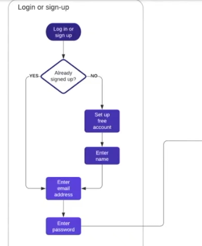
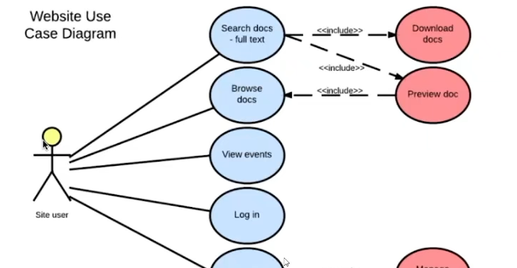
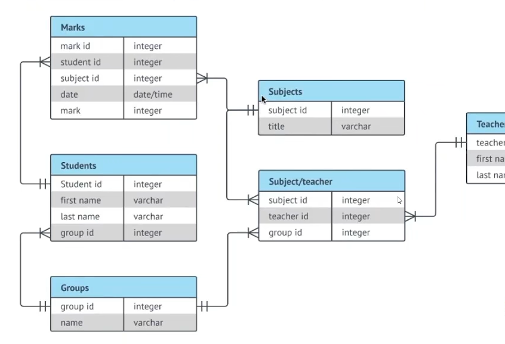
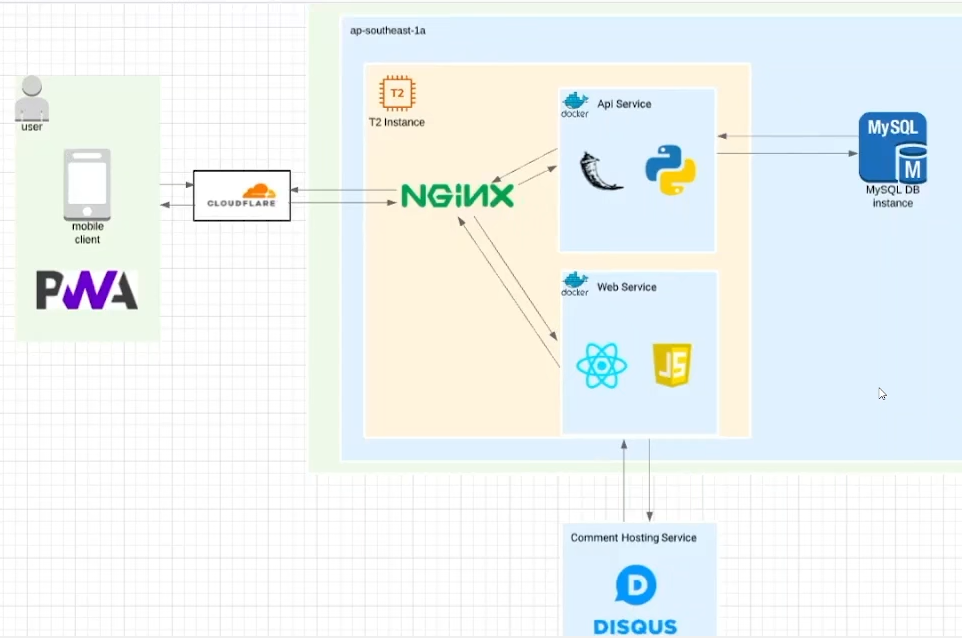
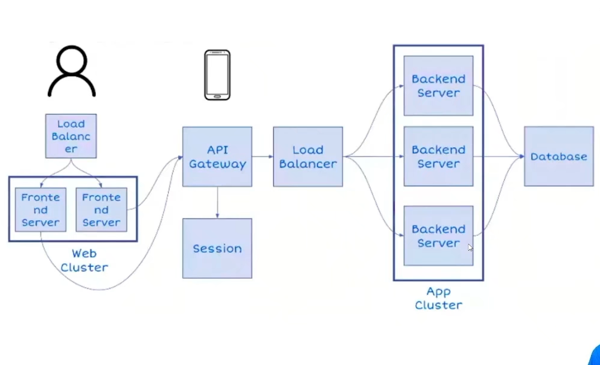
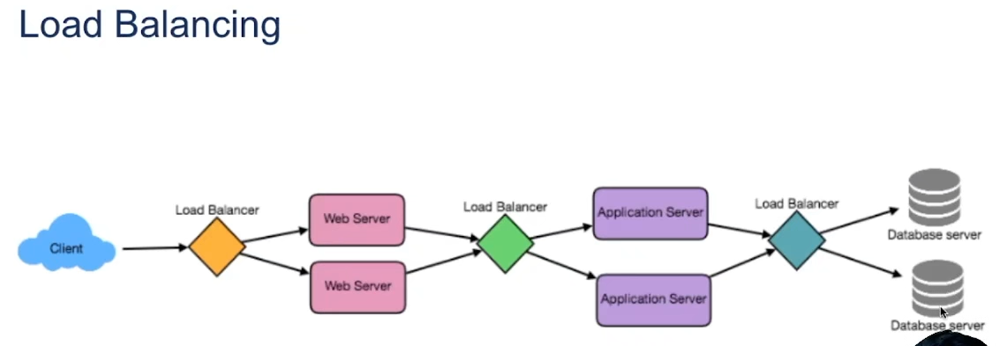
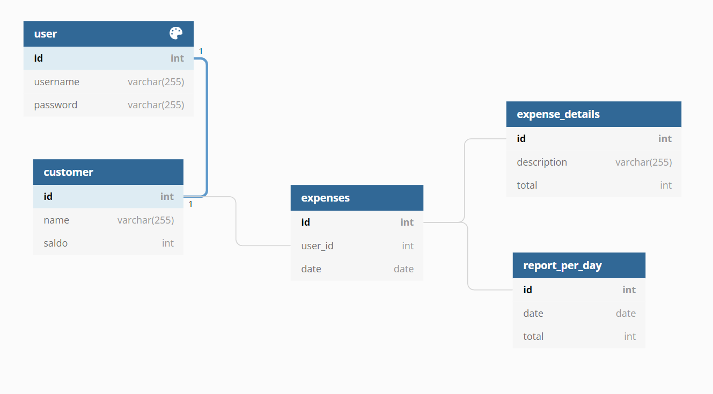
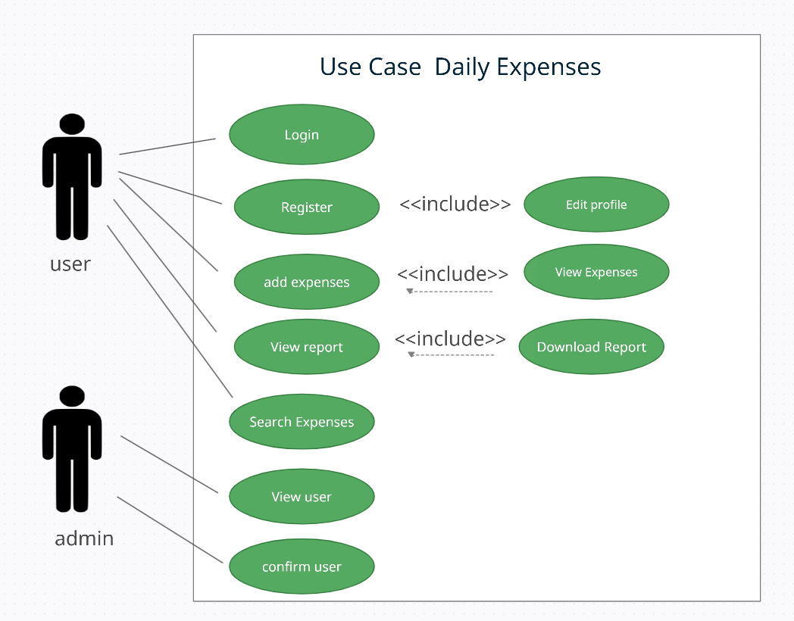

# (18) System Design

## Resume
Dalam materi ini, mempelajari:
1. Diagram Design
2. Horizontal and Vertical Scaling
3. Job/Work Queue
4. SQL and NoSQL
5. Caching

### Diagram 
Merupakan sebuah simbol yang mempresentasikan informasi yang mau disampaikan.

#### Software Design
- Flowchart
- Use Case
- ERD
- HLA

#### Flowchart
Sebuah representasi dari sebuah diagram yang memvisualisasikan dari sebuah alur atau proses.



#### Use Case Diagram
Sebuah ringkasan dari sebuah sistem dan interaksi dengan aktor pengguna user.



#### ERD
Sebuah entity atau tabel rancangan untuk membuat database.



#### HLA
High Level Architecture adalah sebuah gambaran sistem teknologi pada rancangan sebuah aplikasi.




#### Key Characteristics of Distributed Systems
1. Scalability
- Vertical Scale 
    Upaya untuk meningkatkan kapabilitias dari single server
- Horizontal Scale 
    Upaya untuk meningkatkan kapabilitas dari multiple server dimana masing2 dari server tersebut tidak memiliki banyak perubahan dari segi spesifikasi
2. Reliability
3. Availability
4. Efficiency
5. Serviceability or Manageability


### Job/Work Queue
Antrian pekerjaan berisi daftar pekerjaan yang menunggu untuk diproses oleh subsistem

#### Load Balancing
Merupakan proses pembagian beban traffic sebuah aplikasi atau server.



#### Monolithic and Microservices
- Monolithic Merupakan arsitektur dimana keseluruhan kode akan dikompilasi menjadi satu aplikasi
- Microservices adalah pendekatan arsitektur cloud dimana satu aplikasi terdiri dari banyak komponen dan layanan yang dapat digunakan secara independen

### SQL and NoSQL

#### Benefit Relational DB
- Dirancang untuk segala keperluan
- Memiliki standar yang jelas
- Memiliki banyak tool (administrasi, reporting, framework)
####  Prinsip SQL
- Atomicity
Transaksi terjadi semua atau tidak sama sekali
- Consistency
Data tertulis merupakan data valid yang ditentukan berdasarkan aturan tertentu
- Isolation
Pada saat terjadi request yang bersamaan (concurrent), memastikan bahwa transaksi dieksekusi seperti dijalankan secara sekuensial.
- Durability
Jaminan bahwa transaksi yang telah tersimpan, tetap tersimpan

#### NoSQL
Not only SQL, merupakan penyimpanan data yang tidak memiliki relasi\
Mekanisme yang lebih fleksibel menghindari:
- Effort pada sifat transaksi ACID
- Kompleksitas SQL
- Design Schema diawal
- Transaction ditangani oleh aplikasi

#### Kelebihan NoSQL
1. Schema less
    - Tidak memiliki skema ketika menambahkan data
    - Aplikasi menangani proses validasi tipe data
    - Mendukung proses aggregasi dokumen pada item
2. Fast development
3. Support big size file
4. Support cluster

#### Tipe/Kategori
1. Key/Value: redis
    - Tipe yang paling simpel
    - Hash Table
    - Diakses menggunakan key
    - Use case: cache
2. Column - family: cassandra
    - Penyimpanan data per-kolom
    - Use case: On-line Analytical Processing (OLAP)
3. Graph: neo4j
    - Memodelkan struktur relasi dari data
    - Use case: Social network analysis
4. Document - based: mongoDB
    - Menyimpan informasi sebagai dokumen
    - Use case: Unstructured data: Logging

### Caching 
 Merupakan proses menyimpan data sementara, dimana browser atau aplikasi tidak perlu untuk mengunduh data secara berulang atau terus – menerus

#### Database Replication
#### Redundancy and Replication
Merupakan proses penyalinan atau penyimpanan database yang sama secara berulang dalam beberapa file, sehingga data yang sama di simpan di dalam lebih dari 1 lokasi

#### Database Indexing
Merupakan suatu cara untuk mengoptimalkan kinerja database dengan meminimalkan jumlah akses yang diperlukan saat query diproses


## Task
### 1. Problem 1 - Diagram 
Pada task ini, mengimplementasikan design ERD dan Use case berupa sistem yang dapat digunakan untuk mencatat pengeluaran sesorang dalam jangka waktu harian.

[Task.txt ](./praktikum/Task.txt)

output:\



### 1. Problem 2 - Query (Optional - Nilai Tambah)
Terdapat sebuah query SQL
```
SELECT * FROM users;
```
tuliskan dalam bentuk perintah:
1. Redis
2. Neo4j
3. Cassandra

[Task.txt ](./praktikum/Task.txt)

1. Redis
```
HGETALL users
```

2. Neo4j
```
MATCH (u:users)
RETURN u;
```

3. Cassandra
```
select * from users;
```


