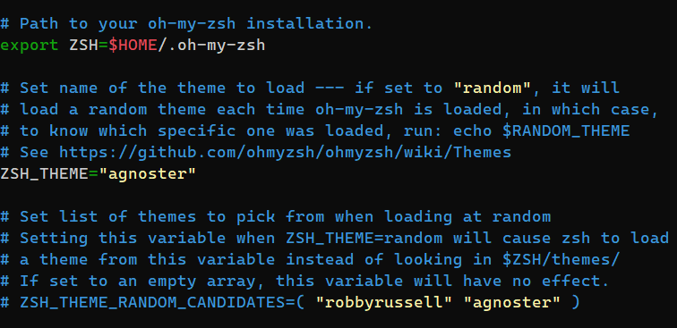
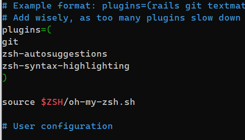
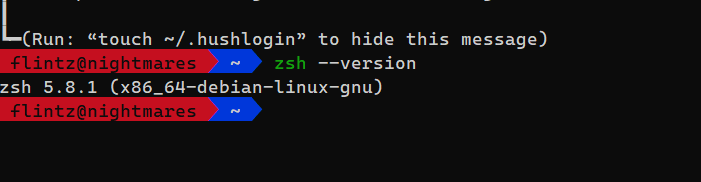
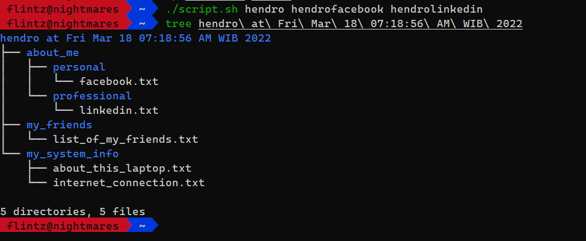

# (19) Configuration Management and CLI

## Resume
Dalam materi ini, mempelajari:
1. CLI 
2. UNIX Shell Most Popular Commands

### CLI
Command Line Interface adalah antarmuka yang cepat dan powerful berbasis teks yang digunakan untuk berkomunikasi secara lebih efektif dan efisien dengan komputer untuk menyelesaikan serangkaian tugas yang lebih luas.

#### Kelebihan CLI
- Granural Control
- Faster management of a large number
- Kemampuan script untuk otomasi task
- Interface untuk membantu troubleshooting 


### UNIX Shell Most Popular Commands

#### Directory

```
pwd     // mengecek posisi path saat ini / working directory
ls      // melihat list file
mkdir   // membuat folder
cd      // pindah directory
rm      // menghapus file
cp      // mengcopy file
mv      // memindahkan file / merename
ln      // membuat link antar file
```

#### Files

- Create: touch
- View: head, cat, tail, less
- Editor: vim, nano
- Permission: chown, chmod
- Different: diff

#### Network

```
ping        // cek koneksi
ssh         // konek ke server
netstat     // cek port aktif
nmap        // port scanning
ifconfig    // cek ip
wget        // mengambil file
curl        // get data
telnet      // membuat koneksi 
```

#### Utlity

```
man         // manual command
env         // cek environment variable
echo        // mencetak string
date        // menampilkan tanggal
which       // menampilkan file executable
watch       // menjalankan perintah berulang
sudo        // root / superuser
history     // cek history command
grep        // mencari string pada file 
locate      // mencari file dan direktori 
```


## Task
### 1. Problem 1 - Install oh-my-zsh 
Pada task ini, menginstal ZSH menggunakan CLI 

Install prerequisite packages
```
$ sudo apt-get install zsh
$ sudo apt-get install powerline fonts-powerline
```

Install Oh My Zsh!
```
$ sh -c "$(curl -fsSL https://raw.github.com/ohmyzsh/ohmyzsh/master/tools/install.sh)"
```

Edit default configuration theme
```
$ nano ~/.zshrc
```

Change ZSH_THEME="agnoster"



Change default shell
```
$ chsh -s /bin/zsh
```

Install ZSH Syntax Highlighting and ZSH Auto Suggestions
```
$ git clone https://github.com/zsh-users/zsh-autosuggestions.git $ZSH_CUSTOM/plugins/zsh-autosuggestions
$ git clone https://github.com/zsh-users/zsh-syntax-highlighting.git $ZSH_CUSTOM/plugins/zsh-syntax-highlighting
```

Add plugin zsh-autosuggestions and zsh-syntax-highlighting in .zhsrc  

```
$ nano ~/.zshrc
```



Finish Install
output:\



### 2. Problem 2 - Create Automation Script 
Pada task ini, membuat otomasi script menghasilkan sesuai output

[Script Automate ](./screenshots/script.sh)\

```
#! /bin/bash

dir="$1 at $(date)"

listFriend=$(curl -s "https://gist.githubusercontent.com/tegarimansyah/e91f335753ab2c7fb12815779677e914/raw/94864388379fecee450fde26e3e73bfb2bcda194/list%2520of%2520my%2520friends.txt")
name=$(whoami)
host=$(uname -a)
ping=$(ping "google.com" -c 3)

mkdir "$dir" && cd "$dir"

mkdir "about_me" "my_friends" "my_system_info"
cd "about_me" && mkdir "personal" "professional"
cd "personal" && echo "https://www.facebook.com/$2" > facebook.txt
cd "../professional" && echo "https://www.linkedin.com/in/$3" > linkedin.txt
cd "../../my_friends" && echo "$listFriend" > list_of_my_friends.txt
cd "../my_system_info" &&  printf "My username: $name\nWith host: $host" > about_this_laptop.txt && echo "$ping" > internet_connection.txt

```

Run
```
./script.sh hendro hendrofacebook hendrolinkedin
```

output:\



