# (20) Intro RESTful API 

## Resume
Dalam materi ini, mempelajari:
1. API
2. REST
3. JSON
4. HTTP Response Code
5. REST API Design Best Practice
6. Open API

### API
Application Programming Interface adalah sebuah kumpulan fungsi dan prosedur untuk mengakses sebuah fitur atau data pada sistem apliaksi atau sebuah service.

### REST
Representational State Transfer adalah sekumpulan aturan yang digunakan membangun aplikasi terdistribusi.

#### HTTP request Method
- GET 
- POST
- PUT
- DELETE
- HEAD
- OPTION
- PATCH

#### Request & Response format:
- JSON
- XML
- SOAP

### JSON
JavaScript Object Notation merupakan sebuah format data yang digunakan untuk penukaran dan penyimpanan sebuah data

### HTTP Response Code
- 200 OK
- 201 Created
- 400 Bad Request
- 404 Not Found
- 401 Unauthorized
- 405 Method Not Allowed
- 500 Internal Server Error

### Postman
Postman adalah HTTP client yang digunakan untuk melakukan testing sebuah web service. psotman dapat membantu testing dengan mudah dan melakukan development dengan cepat dan simple.

### REST API Design Best Practice
- Menggunakan kata benda dari pada kata kerja
```
GET /books/123
DELETE /books/123
POST /books
```

- Menggunakan kata jamak dari pada tunggal
```
GET /cars/123
POST /cars
```

- Menggunakan Resource Nesting
```
/users                      // user list
/users/123                  // specicif user
/users/123/orders           // order list to specific user
/users/123/orders/0001      // specific order of specific user
```

#### Filtering, Sorting, Paging, and Field Selection
Filtering
```
GET /users?country=USA
```

Sorting
```
GET /users?sort=birthdate_date:asc
```

Paging
```
GET /users?limit=100
```

Field selection
```
GET /users/123?fields=username,email
```

- Handle Trailing Slashes

- Versioning

### Open API
API yang bisa diakses secara publik 
[Public API](https://github.com/public-apis/public-apis)

### Create Server API
package
- net/http
- encoding/json

## Task
### 1. Problem 1 - Postman 
Pada task ini, mengimplementasikan API melalui Postman 

1. Target API 1
[https://newsapi.org/](https://newsapi.org/)
Lakukan request terhadap API minimal 5 API

```
GET newsapi.org/v2/everything?q=java spring
```
output:\
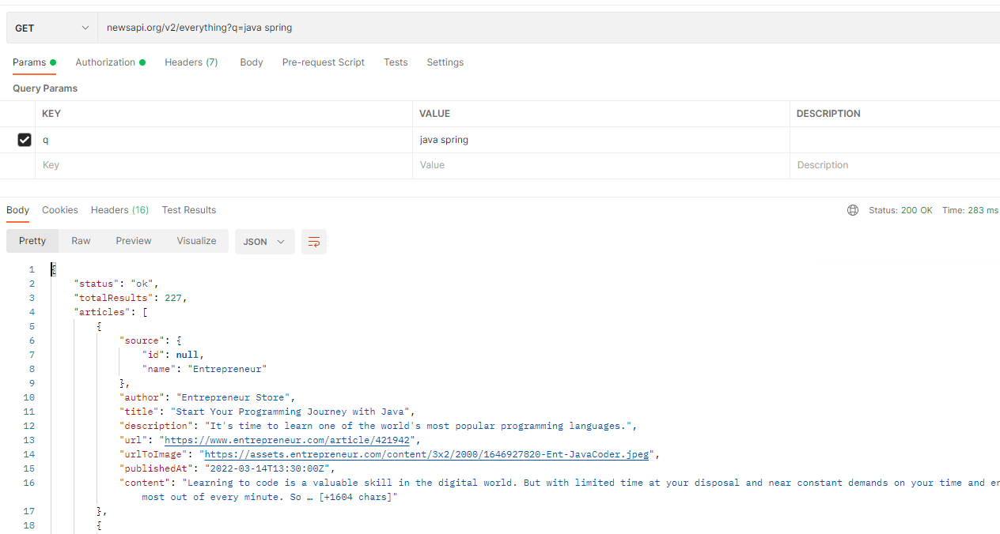

```
GET newsapi.org/v2/everything?q=java spring&searchIn=title
```
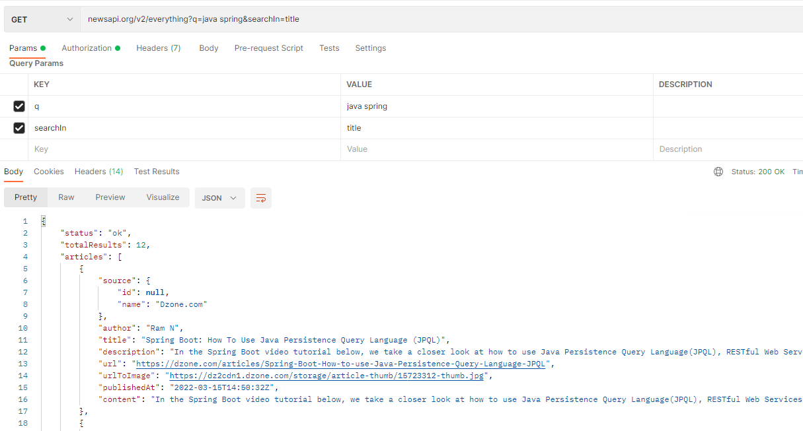

```
GET newsapi.org/v2/everything?q=golang&from=2022-02-21&to=2022-03-20&sortBy=relevancy
```
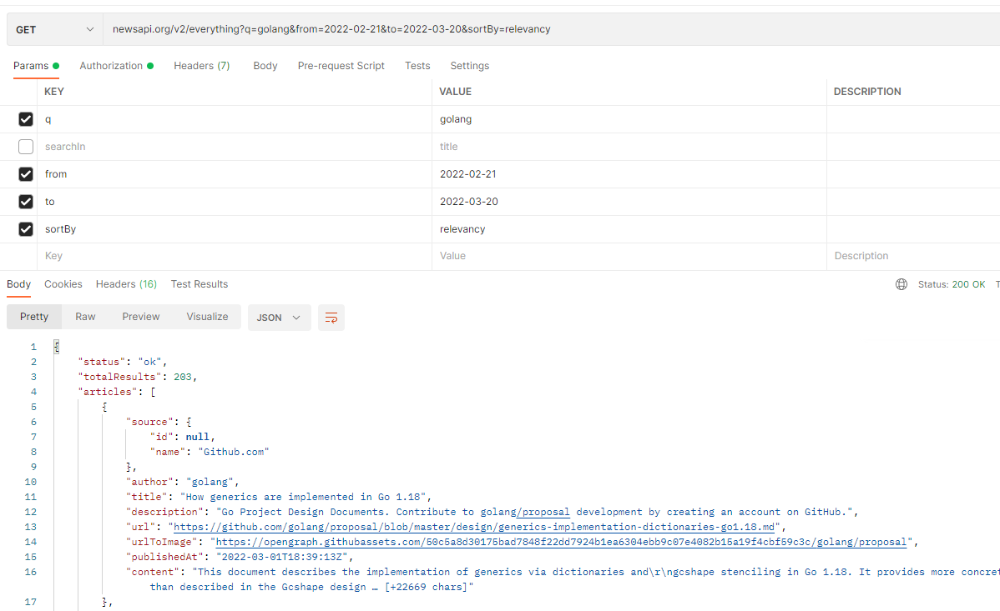

```
GET newsapi.org/v2/top-headlines?country=id
```
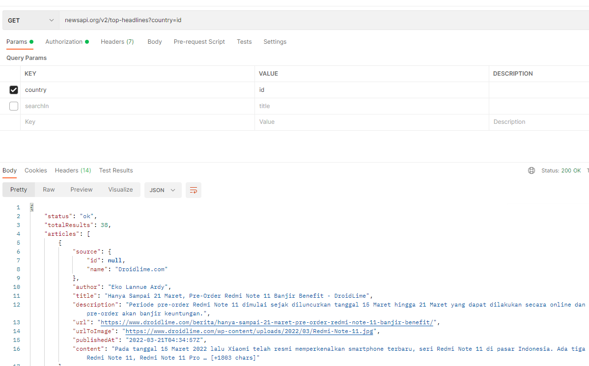

```
GET newsapi.org/v2/top-headlines?country=id&category=sports&q=mandalika
```
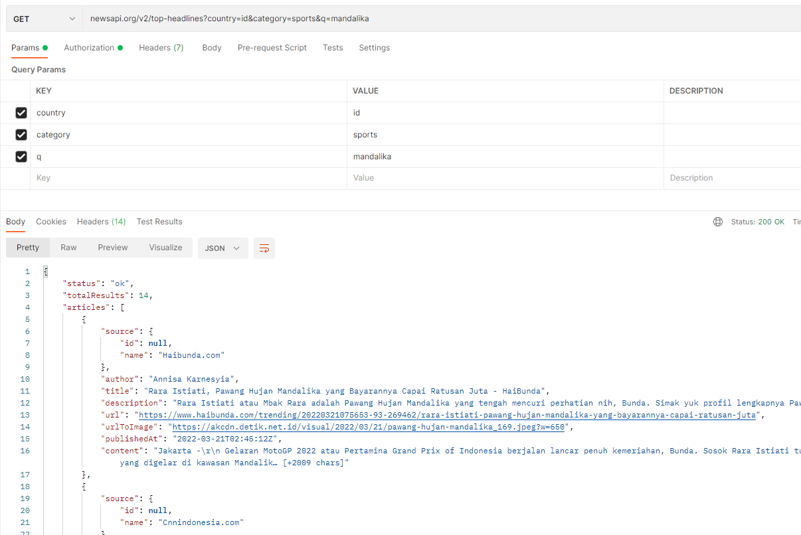


2. Target API 2
[https://swapi.dev/](https://swapi.dev/)
Lakukan request terhadap API minimal 5 API

```
GET swapi.dev/api/planets/1/
```
output:\
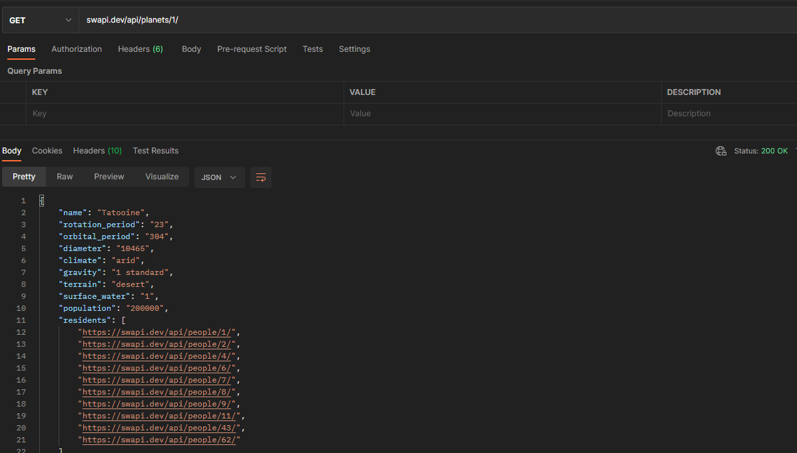

```
GET https://swapi.dev/api/people/?search=darth
```
output:\
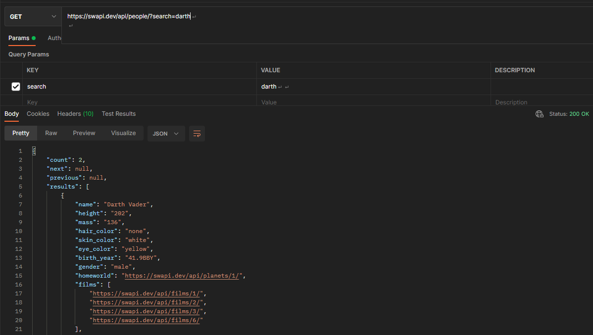

```
GET https://swapi.dev/api/films?search=jedi
```
output:\
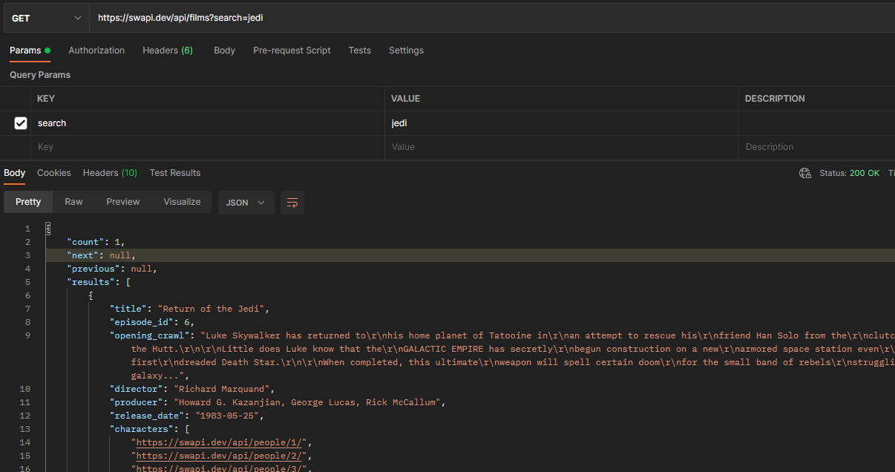

```
GET https://swapi.dev/api/species
```
output:\
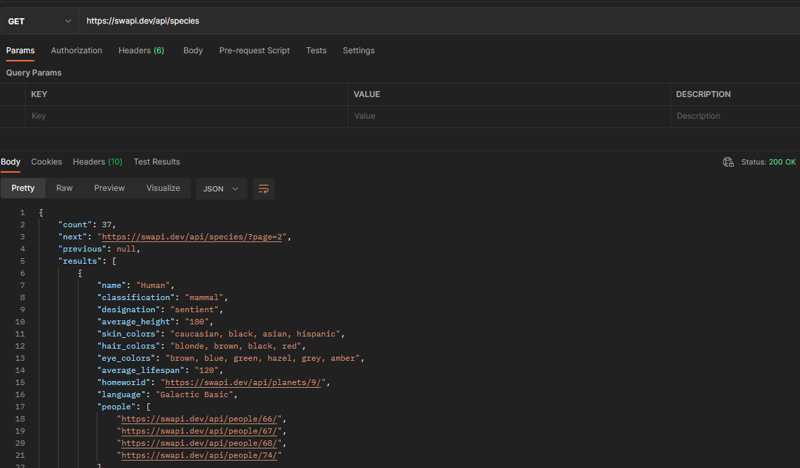

```
GET https://swapi.dev/api/starships/?page=2
```
output:\
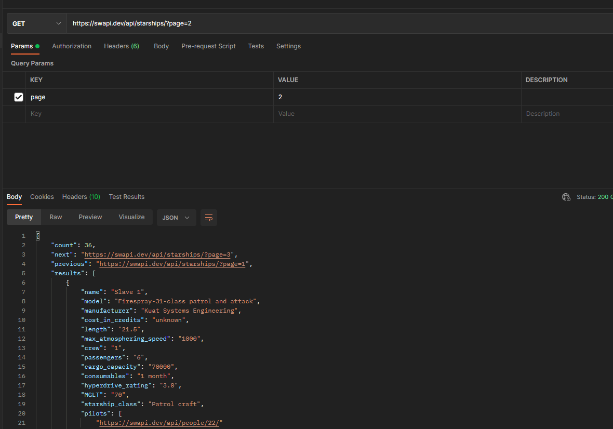


3. Target API 3
[https://app.swaggerhub.com/apis-docs/sepulsa/RentABook-API/1.0.0](https://app.swaggerhub.com/apis-docs/sepulsa/RentABook-API/1.0.0)
Lakukan request terhadap API GET, POST, PUT, DELETE

```
GET virtserver.swaggerhub.com/sepulsa/RentABook-API/1.0.0/client/
```
output:\
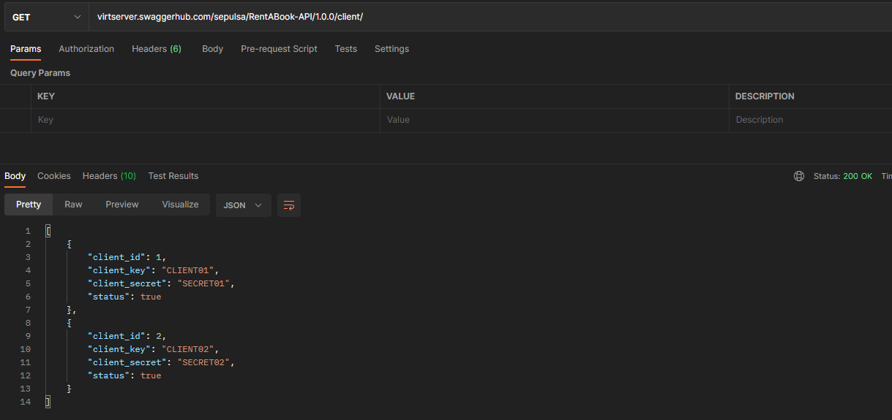

```
POST virtserver.swaggerhub.com/sepulsa/RentABook-API/1.0.0/client/
```
output:\
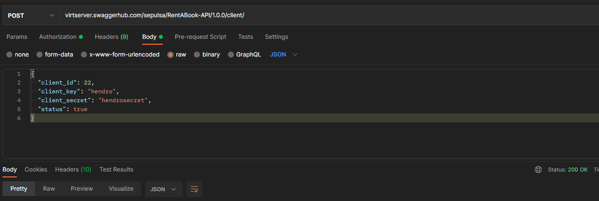

```
PUT virtserver.swaggerhub.com/sepulsa/RentABook-API/1.0.0/book/1234
```
output:\
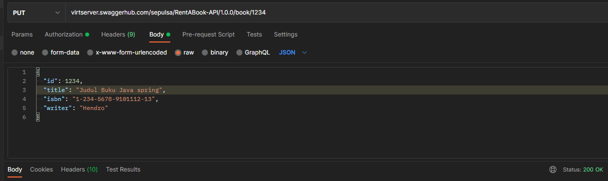

```
DELETE virtserver.swaggerhub.com/sepulsa/RentABook-API/1.0.0/user/1
```
output:\
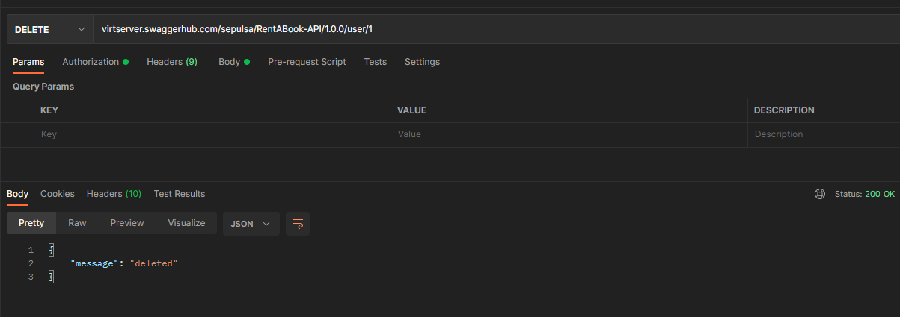


