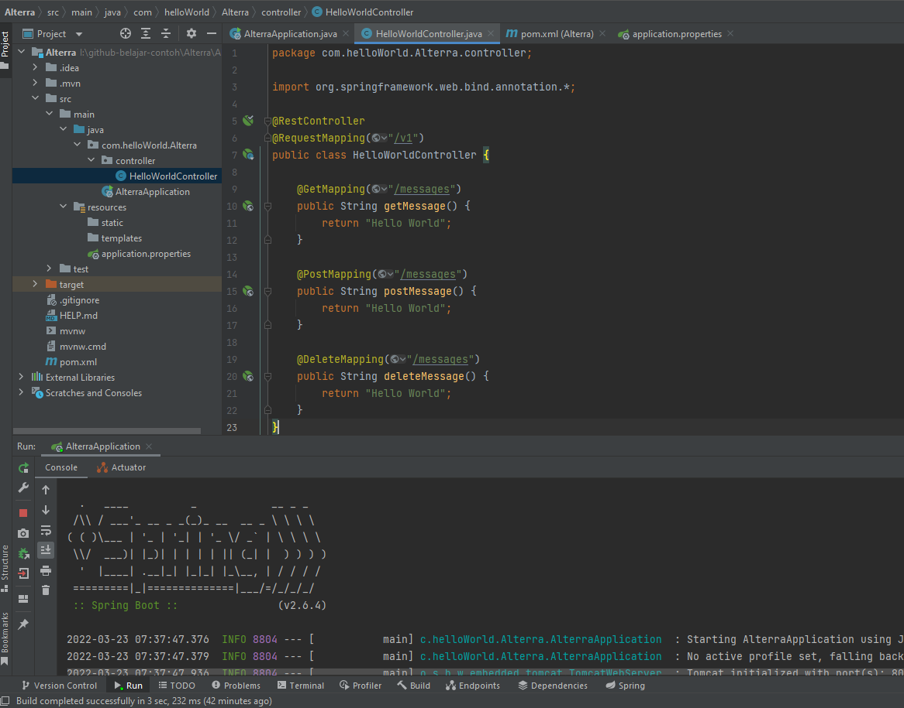
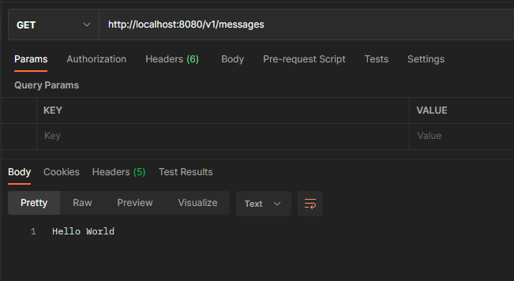
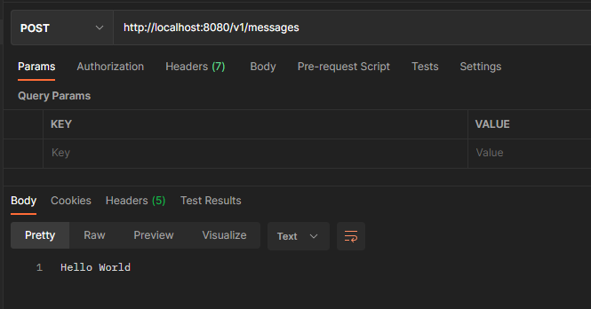
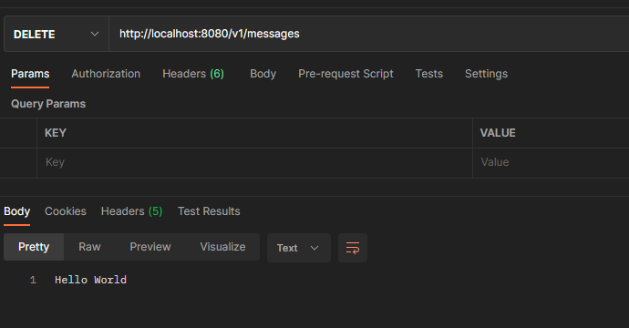

# (21) Intro Spring Boot (Maven - Dependency - Pom)

## Resume
Dalam materi ini, mempelajari:
1. Spring Boot
2. Maven

### Spring Boot
Merupakan framework aplikasi untuk platform Java

### Maven
Build Automation Tools untuk membantu memanage aplikasi java
- Automate manage dependencies
- Automate manage build application to binary
- Automate manage your testing

#### Common Lifecycle in Maven
- validate
- compile
- test-compile
- test
- package
- integration
- install
- deploy

#### Common CLI in Spring Boot
```
mvn spring-boot:run     // to run spring boot

mvn clean install       // to clean and install all related local dependencies
```

## Task
### 1. Problem 1 - Say Hello from Springboot
Pada task ini, menampilkan hello world dalam 3 endpoint\
a. GET /v1/messages\
b. POST /v1/messages\
c. DELETE /v1/messages

[Praktikum](./praktikum/Alterra)

output:





### 2. Problem 2 - Endpoint Description
Pada task ini, menjelaskan masing-masing perbedaannya

- GET
Digunakan untuk mengambil data atau respon dari server
- POST
Digunakan untuk menambah data
- DELETE
Digunakan untuk menghapus data


