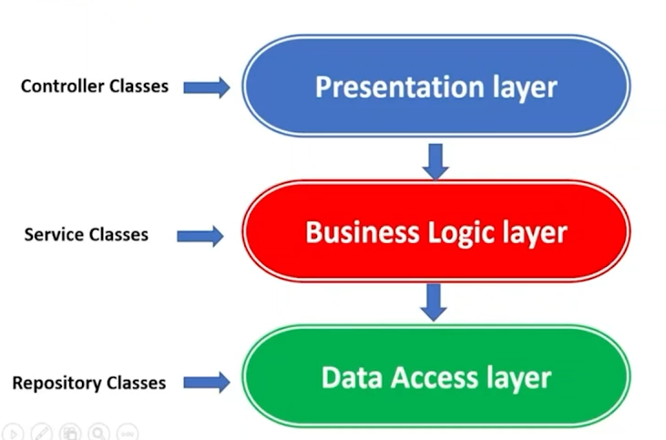

# (22) Getting Started REST Spring Boot (MVC)

## Resume
Dalam materi ini, mempelajari:
1. Spring Boot
2. JPA
3. Annotations, Controller, Service, Repository


### Spring Boot
Spring Boot Framework untuk memudahkan membuat aplikasi berbasis Java.

#### Type Framework
- Opinionated -> Lengkap ( Web Server, Controller, Data Access)
- Non Opinionated -> Modular (Web Server)

#### Kelebihan Spring Boot
- Spring boot menyediakan cara yang fleksibel untuk mengonfigurasi Java Beans, konfigurasi XML, dan Transaksi Database.
- menyediakan pemrosesan batch yang kuat dan mengelola REST endpoint.
- Di Spring Boot, semuanya dikonfigurasi secara otomatis; tidak diperlukan konfigurasi manual.
- Menawarkan aplikasi berbasis anotasi.
- Memudahkan manajemen dependency.
- termasuk Embedded Servlet Container.

#### Spring Boot Architecture



#### Annotations
```java
@RestController     // controller class
@RequestMapper      // path naming
@GetMapping         // GET method
@PostMapping        // POST method
@PutMapping         // PUT method
@DeleteMapping      // DELETE method
```

```java
@Service        // service class
@Autowired      // enabling to inject the object dependency implicity
```
#### Controller (Presentation Layer)
logic related to user interface (HTTP request and HTTP response)
```java
@RestController
@RequiredArgsConstructor
@RequestMapping("/product")
public class ProductController {
    private final ProductService productService;

    @GetMapping("/{id}")
    public BaseResponse<ProductOutput> getProduct(@PathVariable final Long id) {
        return new BaseResponse<>(productService.getProduct (id));
    }
}
```

#### Service / Business Logic Layer
every business logic done here.
```java
@Service
@RequiredArgsConstructor

public class ProductServiceImpli implements ProductService {
    private final ProductRepository productRepository;
    private ModelMapper modelMapper;

    @Autowired
    public void setModelMapper(ModelMapper modelMapper) {
        this.modelMapper = modelMapper;
    }

    @Override
    public ProductOutput getProduct(Long id) {
        Optional <Product> product = productRepository.findById(id);
        return modelMapper.map(product, ProductOutput.class);
    }
}
```

#### Repository / Data Layer
Every database access happens here.
``` java
public interface ProductRepository extends CrudRepository<Product, Long> {

}
```

### JPA and Hibernate
Java Persistence API (JPA) adalah spesifikasi yang mendefinisikan bagaimana mempertahankan data dalam aplikasi Java
Hibernate adalah implementasi standar dari spesifikasi JPA

#### JPA Dependencies
```
        <dependency>
			<groupId>org.springframework.boot</groupId>
			<artifactId>spring-boot-starter-web</artifactId>
		</dependency>
```

#### Spring JPA and Datasource Properties
```
spring.datasource.url=jdbc:postgresql://localhost:5432/demo
spring.datasource.username=root
spring.datasource.password=root

spring.jpa.hibernate.ddl-auto=update
spring.jpa.show-sql=true
```

## Task
### 1. Problem 1 - H2 Database
Pada task ini, membuat project Springboot dengan database H2 dan struktur MVC dalam 3 endpoint.\
a. GET /v1/posts\
b. POST /v1/posts\
c. DELETE /v1/posts/{id}

[Praktikum](./praktikum/Alterra)

output:


### 2. Problem 2 - Repository
Pada task ini, menggunakan CrudRepository dan JpaRepository dan perbedaan

Pada CrudRepository mempunyai fungsi crud seperti save, findall, delete dll. mempunyai semua basic query yang dibutuhkan
Pada JpaRepository mempunyai method yang sama dengan CrudRepository dan mempunyai method yang lebih lengkap


output CrudRepository:


output JpaRepository:


