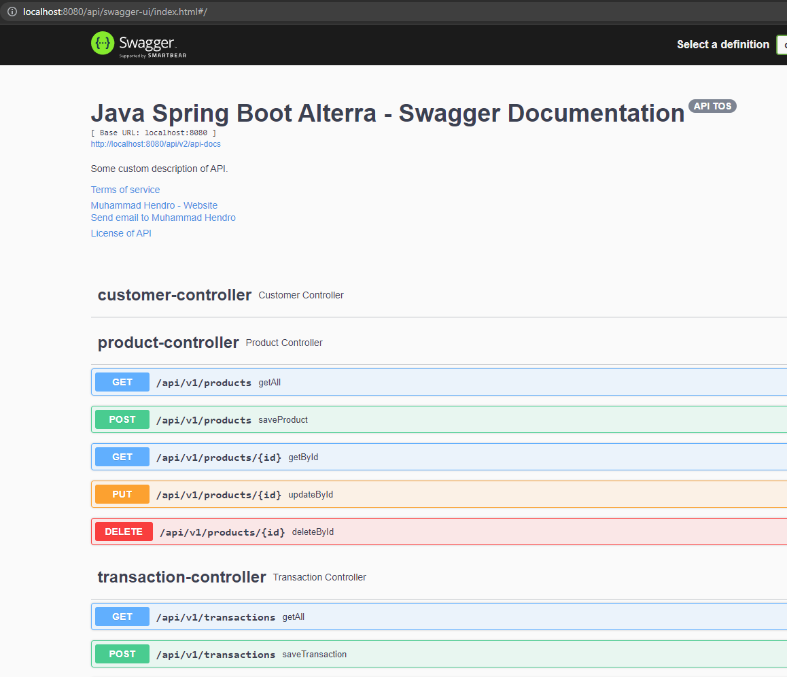
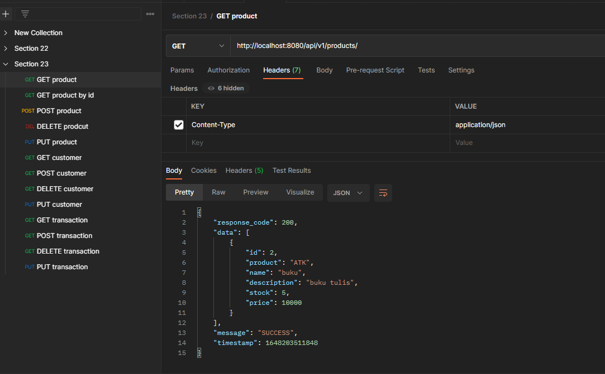
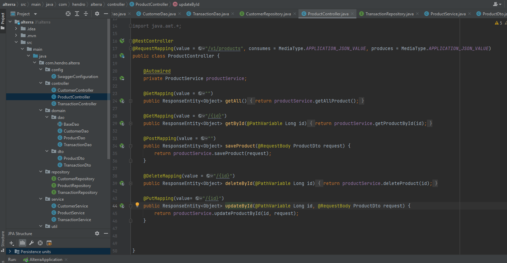
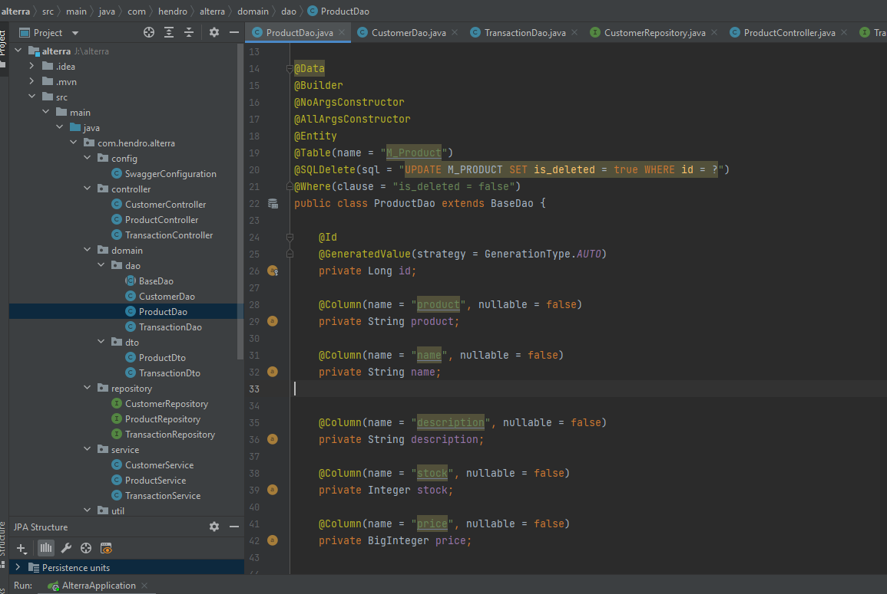

# (23 & 24) Configure Swagger Documentation Spring Boot | JPA (Spring Database SQL)

## Resume
Dalam materi ini, mempelajari:
1. API Documentation
2. Swagger
3. JPA

### API Documentation
Konten teknis yang mendokumentasikan API. mencakup petunjuk tentang cara menggunakan dan mengintegrasikan API secara efektif. juga menyediakan pembaruan pada API seperti versi baru. Beberapa aspek dokumentasi API dapat dibuat secara otomatis melalui Swagger atau dokumen lainnya

### Swagger
- OpenAPI specification
- Open Source
- Great API Docs UI for Frontend or mobile developer

### OpenAPI Specification
standar untuk mendefinisikan interface RESTful. OAS memungkinkan pengembang untuk merancang technology-agnostic API interface yang menjadi dasar pengembangan dan konsumsi API.

#### Swagger Dependencies
```xml
<dependency>
    <groupId>io.springfox</groupId>
    <artifactId>springfox-swagger2</artifactId>
    <version>3.0.0</version>
</dependency>
<dependency>
    <groupId>io.springfox</groupId>
    <artifactId>springfox-swagger-ui</artifactId>
    <version>2.9.2</version>
</dependency>

```

#### Swagger Configuration
```java
@Configuration
@EnableSwagger2
public class SwaggerConfiguration {                                    
    @Bean
    public Docket api() { 
        return new Docket(DocumentationType.SWAGGER_2)  
          .select()                                  
          .apis(RequestHandlerSelectors.any())              
          .paths(PathSelectors.any())                          
          .build();                                           
    }
}
```

### JPA and Hibernate
Java Persistence API (JPA) adalah spesifikasi yang mendefinisikan bagaimana mempertahankan data dalam aplikasi Java
Hibernate adalah implementasi standar dari spesifikasi JPA

#### JPA Dependencies
```
<dependency>
    <groupId>org.springframework.boot</groupId>
    <artifactId>spring-boot-starter-web</artifactId>
</dependency>
```

#### Spring JPA and Datasource Properties
```
spring.datasource.url=jdbc:postgresql://localhost:5432/demo
spring.datasource.username=root
spring.datasource.password=root

spring.jpa.hibernate.ddl-auto=update
spring.jpa.show-sql=true
```


## Task
### 1. Challenge 1
Pada task ini, mengimplementasikan CRUD pada spring dan mengintegrasikan dengan Swagger untuk API

[Praktikum](./praktikum/alterra)

output Swagger Documentation:



output Response API:



output CRUD transactionDao and controller:





