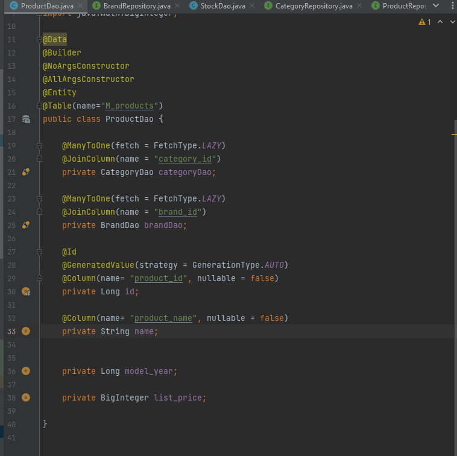
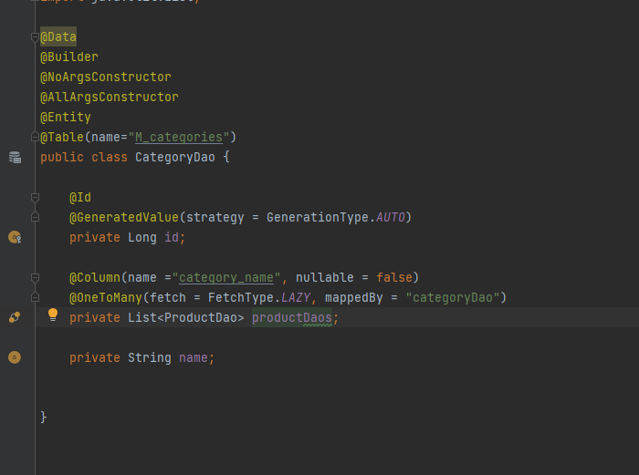
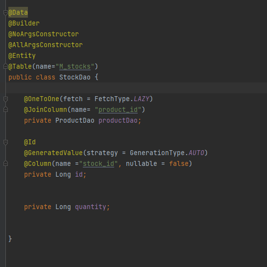
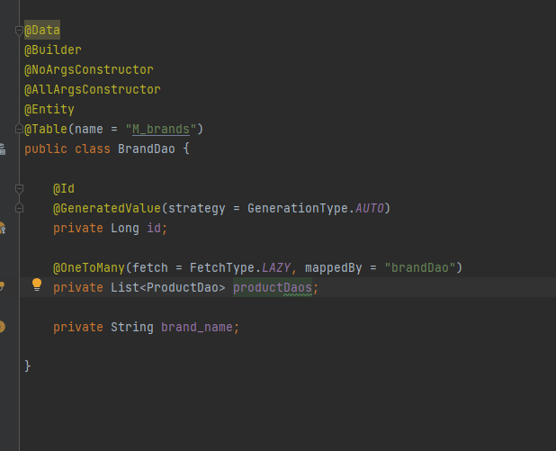
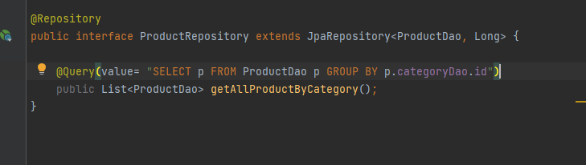
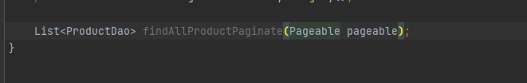
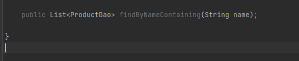

# (25) Impementation Relational (1o1 - 1oMany - ManyoMany)

## Resume
Dalam materi ini, mempelajari:
1. Database Cardinality
2. JPA Queries Advance
3. JPA Entity Relationship


### Database Cardinality
Relasi antar tabel memiliki rasio, perbandingan jumlah baris di satu tabel dengan tabel lainnya.

#### One to one relationship
hanya satu dari masing- masing entity yang saling berhubungan atau berelasi

#### One to many relationship
satu attribute dari satu entity bisa berhubungan dengan dua atau lebih attribute dari entity yang lain

```java
@Entity
@Table(name="customer")
public class Customer {

    @OneToMany(mappedBy="orders")
    private Set<Orders> orders;
}

@Entity
@Table(name="orders")
public class Orders {

    @ManyToOne
    @JoinColumn(name="customer_id", nullable=false)
    private Customer customer;

    public Orders() {}
}
```

#### Many to many relationship
Suatu relasi dimana satu attribute dari satu entity dapat memiliki hubungan dengan dua atau lebih attribute dari entity yang lain, begitupun dengan sebaliknya.

```java
@Entity
class User {

    @Id
    Long id;

    @ManyToMany
    Set<Role> userRoles;
}

@Entity
class Role {

    @Id
    Long id;

    @ManyToMany
    Set<User> roles;
}
```

#### JPA Like Example
```java
@Repository
public interface MovieRepository extends JpaRepository<Movie. Long> {
    List<Movie> findByTitleContaining(String title);
    List<Movie> findByTitleContains(String title);
    List<Movie> findByTitleIsContaining(String title);
}
```

#### JPA Example
```java
@Repository
public interface MovieRepository extends JpaRepository<Movie. Long> {
    @Query("SELECT COUNT(*) from Movie")
    public int movieCounts();

    @Query(value = "SELECT MIN(rented) from Movie")
    public BigDecimal minimumRented();
    
}
```

#### JPA Pagination Example
```java
@Repository
public interface MovieRepository extends JpaRepository<Movie. Long> {
    List<Movie> findAllMoviePaginate(Pageable pageable);
}
```

## Task
### 1. Challenge 1
Pada task ini, mengkonversikan skema database kedalam JPA relationship.

[Praktikum](./praktikum/alterra)

output:






### 2. Challenge 2
Pada task ini, membuat query dengan JPA berikut:
1. Get all products with category\
2. Paginate products\
3. Sort products by category\
4. Search products by name

[Praktikum](./praktikum/alterra)

output:







