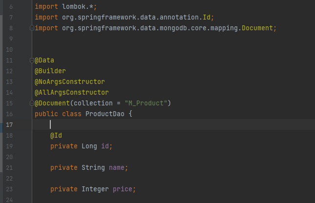
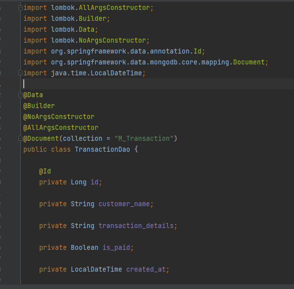
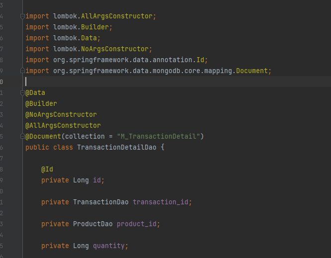
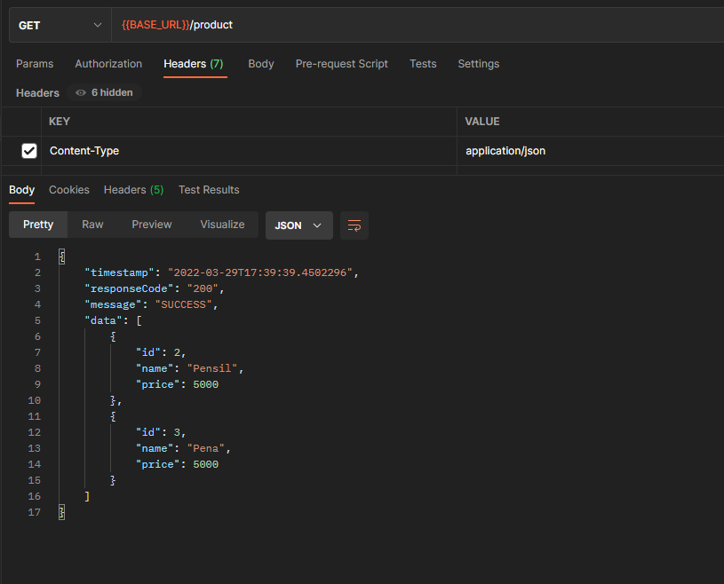
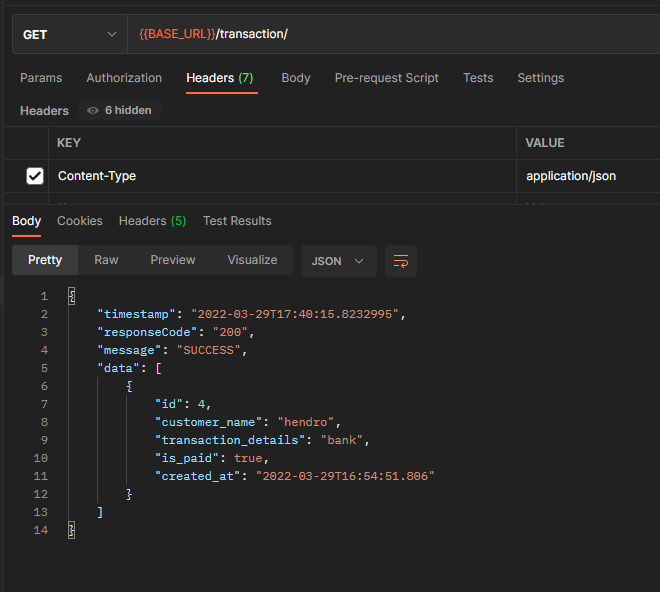
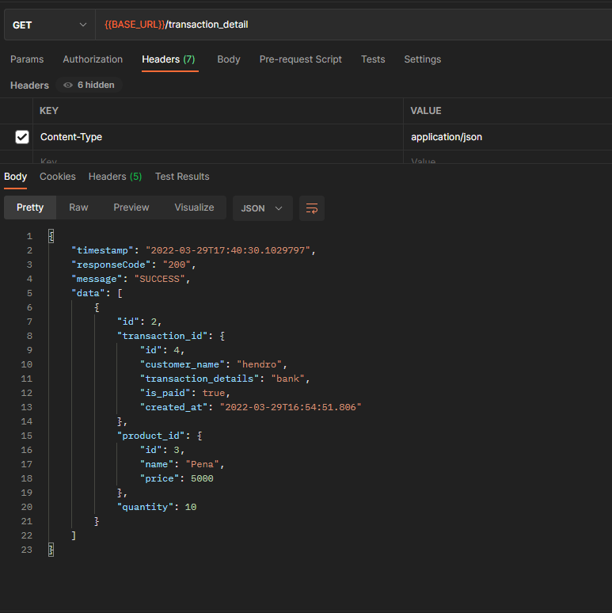

# (26) JPA (Spring Database No SQL)

## Resume
Dalam materi ini, mempelajari:
1. JPA
2. NoSQL MongoDB


#### Required Dependencies
- Spring Web
- Spring Data MongoDB
- Lombok

#### Structure Folder MVC
- Controller
Sebagai kumpulan routing Rest API (endpoint)
- Model
Sebagai bentuk dasar dari business model, POJO (Plain Old Java Object)
- Repository
Sebagai Interface yang berhubungan langsung dengan database
- Service
Kumpulan Interface digunakan untuk business process / rules / logic

#### Configuration Datasource
```
spring.data.mongodb.host=localhost
spring.data.mongodb.port=27017
spring.data.mongodb.database=alterra
spring.data.mongodb.username=root
spring.data.mongodb.password=root
```

#### Create Model
```java
@Data
@Document("products")
public class Product {
    @Id
    private String id;
    private String name;
}
```

#### Create Repository
```java
@Repository
public interface ProductRepository extends MongoRepository <Product, String> {
}
```

#### Create Interface Service
```java
public interface ProductService {
    Product create(Product product);
    List<Product> findAll();
    Product findById(String id);
    Product update(String id, Product product);
    void delete(String id);
}
```

#### Create Class Implement Interface
```java
@Service
@RequiredArgsConstructor
public class ProductServiceImpl implements ProductService {

    private final ProductRepository productRepository;
    
    @Override
    public Product create(Product product) {
        return productRepository.save(product);
    }

    @Override
    public List<Product> findAll() {
        return productRepository.findAll();
    }

    @Override
    public Product findById(String id) {
        return productRepository.findById(id);
    }

    @Override
    public Product update(String id, Product product) {
        Product productById = this.findById(id);
        productById.setName(product.getName());
        return productRepository.save(productById);
    }

    @Override
    public void delete(String id) {
         Product product = this.findById(id);
         productRepository.delete(product);
    }
}
```

#### Create Class Controller
```java
@RestController
@RequestMapping(value = "/products")
@RequiredArgsConstructor
public class ProductController {

    private final ProductService productService;

    @PostMapping("")
    public ResponseEntity<?> create(@RequestBody Product product) {
        Product productCreated = productService.create(product);
        return ResponseEntity.ok(productCreated);
    }

    @GetMapping("")
    public ResponseEntity<?> listProduct() {
        List<Product> products = productService.findAll();
        return ResponseEntity.ok(products);
    }

    @GetMapping("/{id}")
    public ResponseEntity<?> product(@PathVariable String id) {
        Product product = productService.findById(id);
        return ResponseEntity.ok(product);
    }

    @PatchMapping("/{id}")
    public ResponseEntity<?> update(@PathVariable String id, @RequestBody Product product) {
        Product productUpdated = productService.update(id, product);
        return ResponseEntity.ok(productUpdated);
    }

    @DeleteMapping("/{id}")
    public ResponseEntity<?> delete(@PathVariable String id) {
        productService.delete(id);
        return ResponseEntity.noContent().build();
    }
}
```


## Task
### 1. Problem - NoSQL Implementation 
Pada task ini, membuat project Springboot dengan database MongoDB dan struktur MVC yang dapat melakukan CRUD


[Praktikum](./praktikum/alterra)

Model Entity Product output:



Model Entity Transaction output:



Model Entity TransactionDetail output:



Response Get Product output:



Response Get Transaction output:



Response Get TransactionDetail output:




