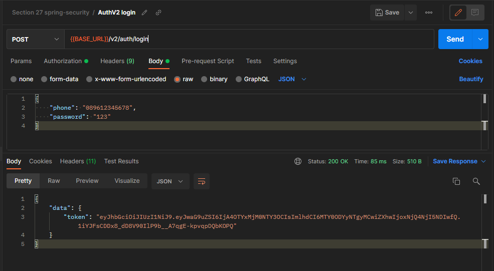
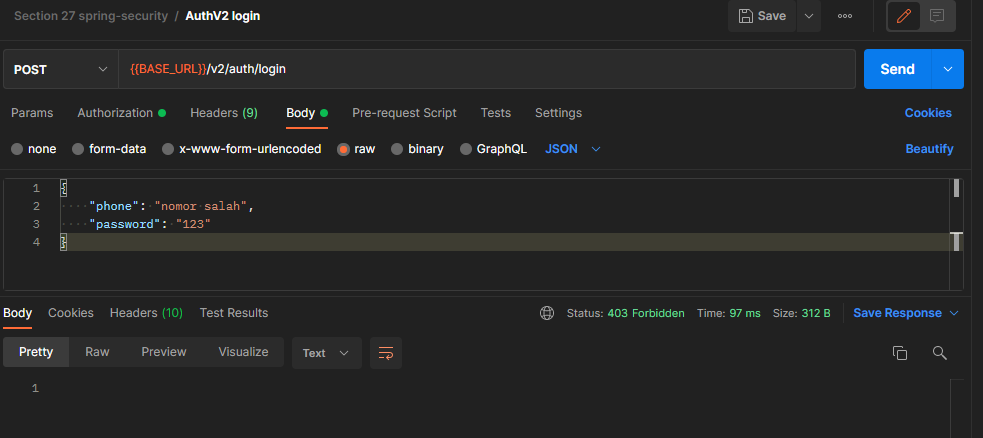

# (27) Spring Security (JWT)

## Resume
Dalam materi ini, mempelajari:
1. JWT
2. Spring Security


### JWT
JWT adalah standar format untuk mengamankan informasi pribadi menjadi sebuah klaim yang akan di encode ke dalam bentuk JSON dan menjadi payload dari JSON Web Signature (JWS).

#### Required Dependecies
- Spring Web
- Spring Security
- JJWT

#### POM Dependency JJWT
```
<dependency>
	<groupId>io.jsonwebtoken</groupId>
	<artifactId>jjwt-api</artifactId>
	<version>0.11.2</version>
</dependency>

<dependency>
	<groupId>io.jsonwebtoken</groupId>
	<artifactId>jjwt-impl</artifactId>
	<version>0.11.2</version>
	<scope>runtime</scope>
</dependency>

<dependency>
	<groupId>io.jsonwebtoken</groupId>
	<artifactId>jjwt-jackson</artifactId>
	<version>0.11.2</version>
	<scope>runtime</scope>
</dependency>
```

#### Configuration Datasource
```
spring.datasource.url=jdbc:postgresql://localhost:5432/spring_security
spring.datasource.username=postgres
spring.datasource.password=root

spring.jpa.show-sql=true
spring.jpa.hibernate.ddl-auto=update

spring.security.user.name=admin
spring.security.user.password=password
```

#### Create Class JwtTokenProvider
```java
@Log4j2
@Component
public class JwtTokenProvider {

    private final Key key = Keys.secretKeyFor(SignatureAlgorithm.HS256);
    private Long expiration = 1000L * 60 * 60;

    public String generateToken(Authentication authentication){
            final User user = (User) authentication.getPrincipal();

            Date now = new Date(System.currentTimeMillis());
            Date expiryDate = new Date(now.getTime() + expiration);

            Map<String, Object> claims = new HashMap<>();
            claims.put("phone", user.getPhone());

            return Jwts.builder()
                    .setId(user.getId().toString())
                    .setSubject(user.getUsername())
                    .setClaims(claims)
                    .setIssuedAt(now)
                    .setExpiration(expiryDate)
                    .signWith(key)
                    .compact();
    }

    public boolean validateToken(String token) {
        try {
            Jwts.parserBuilder().setSigningKey(key).build().parseClaimsJws(token);
            return true;
        } catch (SignatureException ex) {
            log.error("Invalid jwt signature: {}", ex.getMessage());
        } catch (MalformedJwtException ex) {
            log.error("Invalid jwt token: {}", ex.getMessage());
        } catch (ExpiredJwtException ex) {
            log.error("Expired jwt token: {}", ex.getMessage());
        } catch (UnsupportedJwtException ex) {
            log.error("Unsupported jwt token: {}", ex.getMessage());
        } catch (IllegalArgumentException ex) {
            log.error("Jwt claim string is empty: {}", ex.getMessage());
        }
        return false;
    }

    public String getUsername(String token) {
        Claims claims = Jwts.parserBuilder().setSigningKey(key).build().parseClaimsJws(token).getBody();
        return claims.get("phone").toString();
    }

}
```

#### Create Class SecurityFilter
```java
@Log4j2
@Component
@RequiredArgsConstructor
public class SecurityFilter extends OncePerRequestFilter {

    private static final String JWT_HEADER = "Authorization";
    private static final String JWT_TOKEN_PREFIX = "Bearer ";

    private final UserDetailsService userDetailsService;
    private final JwtTokenProvider jwtTokenProvider;

    @Override
    protected void doFilterInternal(HttpServletRequest request, HttpServletResponse response, FilterChain filterChain) throws ServletException, IOException {
        try {
            String token = getJWTFromRequest(request);
            if (token != null && !token.isBlank() && jwtTokenProvider.validateToken(token)) {
                String username = jwtTokenProvider.getUsername(token);
                log.info("username : {}", username);
                UserDetails user = userDetailsService.loadUserByUsername(username);
                UsernamePasswordAuthenticationToken authenticationToken = new UsernamePasswordAuthenticationToken(
                        user, user.getPassword(), user.getAuthorities()
                );
                authenticationToken.setDetails(new WebAuthenticationDetailsSource().buildDetails(request));
                SecurityContextHolder.getContext().setAuthentication(authenticationToken);
            }
        } catch (Exception e) {
            log.error(e.getMessage(), e);
        }
        filterChain.doFilter(request, response);
    }

    private String getJWTFromRequest(HttpServletRequest request) {
        String bearerToken = request.getHeader(JWT_HEADER);
        if (StringUtils.hasText(bearerToken) && bearerToken.startsWith(JWT_TOKEN_PREFIX)) {
            return bearerToken.substring(7);
        }
        return null;
    }
}
```

#### Create Class SecurityConfig
```java
@Configuration
@EnableWebSecurity
@RequiredArgsConstructor
public class SecurityConfig extends WebSecurityConfigurerAdapter {

    private final UserDetailsService userDetailsService;
    private final SecurityFilter securityFilter;

    @Bean
    public PasswordEncoder passwordEncoder() {
        return new BCryptPasswordEncoder();
    }

    @Override
    protected void configure(AuthenticationManagerBuilder auth) throws Exception {
        auth.userDetailsService(userDetailsService)
                .passwordEncoder(passwordEncoder());
    }

    @Bean
    @Override
    protected AuthenticationManager authenticationManager() throws Exception {
        return super.authenticationManager();
    }

    @Override
    protected void configure(HttpSecurity http) throws Exception {
        http.csrf().disable()
                .authorizeRequests()
                .antMatchers("/auth/**").permitAll()
                .antMatchers("/v2/**").permitAll()
                .anyRequest().authenticated();
        // remove session
        http.sessionManagement().sessionCreationPolicy(SessionCreationPolicy.STATELESS);
        // filter jwt
        http.addFilterBefore(securityFilter, UsernamePasswordAuthenticationFilter.class);
    }
}
```

#### Create Service Authentication 
```java
@Log4j2
@Service
@RequiredArgsConstructor
public class AuthServiceImpl implements AuthService {

    private final UserRepository userRepository;
    private final AuthenticationManager authenticationManager;
    private final JwtTokenProvider jwtTokenProvider;
    private final PasswordEncoder passwordEncoder;

    @Override
    public User register(UsernamePassword req) {
        User user = new User();
        user.setUsername(req.getUsername());
        user.setPhone(req.getPhone());
        user.setPassword(passwordEncoder.encode(req.getPassword()));
        return userRepository.save(user);
    }

    @Override
    public TokenResponse generateToken(UsernamePassword req) {
        try {
            Authentication authentication = authenticationManager.authenticate(
                    new UsernamePasswordAuthenticationToken(
                            req.getPhone(),
                            req.getPassword()
                    )
            );
            SecurityContextHolder.getContext().setAuthentication(authentication);
            String jwt = jwtTokenProvider.generateToken(authentication);
            TokenResponse tokenResponse = new TokenResponse();
            tokenResponse.setToken(jwt);
            return tokenResponse;
        } catch (BadCredentialsException e) {
            log.error("Bad credential", e);
            throw new RuntimeException(e.getMessage(), e);
        } catch (Exception e) {
            log.error(e.getMessage(), e);
            throw new RuntimeException(e.getMessage(), e);
        }
    }
}
```

#### Create Controller Authentication 
```java
@RestController
@RequestMapping("/auth")
@RequiredArgsConstructor
public class AuthController {

    private final AuthService authService;

    @PostMapping(value="/register")
    public ResponseEntity<?> register(@RequestBody UsernamePassword req) {
        authService.register(req);
        return ResponseEntity.ok().build();
    }

    @PostMapping(value="/token")
    public ResponseEntity<?> generateToken(@RequestBody UsernamePassword req) {
        TokenResponse token = authService.generateToken(req);
        return ResponseEntity.ok(token);
    }
}
```

## Task
### 1. Problem 1 - JWT Generation
Pada task ini, menampilkan response token jika phone dan password benar

[Praktikum](./praktikum/spring-security)

Response 200 Success output:



Response 403 output:



### 2. Problem 2 - JWT Extraction
Pada task ini, menampilkan response nomor HP dari JWT

[Praktikum](./praktikum/spring-security)


