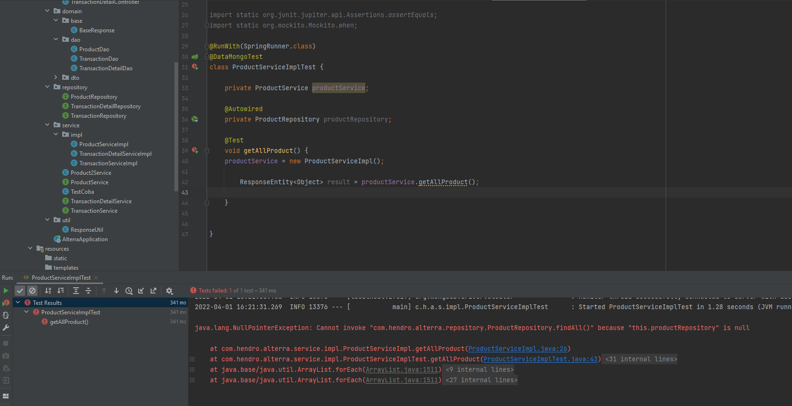

# (28) Unit Testing

## Resume
Dalam materi ini, mempelajari:
1. 


### Unit Testing
Merupakan jenis software testing yang dilakukan untuk menguji suatu bagian atau komponen software.

#### Unit Testing Concern
- Functional correctness and completeness
- Error handling
- Checking input values (parameter)
- Correctness of output data (return values)
- Optimizing algorithm and performance

#### Unit Testing Benefits
- Quality of code
- Finds software bugs early
- Faster development
- Better design
- Reduce costs

#### F.I.R.S.T Principle of Testing
- Fast
- Isolated/Independent 
- Repeatable
- Self-validating
- Thorough

#### Mocking @Autowired
use @InjectMocks in class that use Autowired objects

#### Easy Random Dependency
```
<dependency>
    <groupId>org.jeasy</groupId>
    <artifactId>easy-random-core</artifactId>
    <version>5.0.0</version>
    <scope>test</scope>
</dependency>
```

#### Gson Dependency
```
<dependency>
    <groupId>com.google.code.gson</groupId>
    <artifactId>gson</artifactId>
    <version>2.9.0</version>
</dependency>
```

#### Setup JaCoCo
```
<build>
		<plugins>
			<plugin>
				<groupId>org.jacoco</groupId>
				<artifactId>jacoco-maven-plugin</artifactId>
				<version>0.8.5</version>
				<executions>
					<execution>
						<goals>
							<goal>prepare-agent</goal>
						</goals>
					</execution>
					<execution>
						<id>report</id>
						<phase>test</phase>
						<goals>
							<goal>report</goal>
						</goals>
					</execution>
				</executions>
			</plugin>
		</plugins>
	</build>
```

[Service Test Example](https://github.com/auliahanifan/springboot/blob/master/product-impl/src/test/java/com/auliahanifan/web/product/service/ProductServiceImplTest.java)

[Controller Test Example](https://github.com/auliahanifan/springboot/blob/master/product-impl/src/test/java/com/auliahanifan/web/product/controller/ProductControllerTest.java)


## Task
### 1. Problem - Business Logic Layer Testing
Pada task ini, mengimplementasikan unit test pada bagian service minimum 3 test case.

[Praktikum](./praktikum/alterra)

output:




