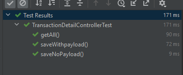

# (29) Integration Test 

## Resume
Dalam materi ini, mempelajari:
1. Software Testing
2. Unit Testing
3. Integration Testing
4. Spring Boot Testing


### Software Testing
Merupakan sebuah metode yang dijalankan perusahaan untuk memeriksa apakah aplikasi sudah sesuai dengan persyaratan yang diharapkan atau belum.

### Software Testing Types
1. Functional Testing
- Unit testing
- Sanity testing
- Smoke testing
- Regression Testing
- Integration Testing
- Beta/Usability Testing

2. Non-Functional Testing
- Security
- Reliability
- Survivability
- Availability
- Usability
- Scalability
- Interoperability
- Efficiency
- Flexibility
- Portability
- Reusability

3. Maintenance Testing
- Regression
- Maintenance

#### Unit Testing
Merupakan jenis software testing yang dilakukan untuk menguji suatu bagian atau komponen software.

#### Integration Testing
Merupakan sebuah tahap dimana hasil dari penggabungan unit-unit atau komponen aplikasi yang berinteraksi di dalam software diuji coba.

### Spring Boot Testing

#### The Dependencies
```
<dependency>
    <groupId>org.junit.vintage</groupId>
    <artifactId>junit-vintage-engine</artifactId>
    <version>5.8.2</version>
    <scope>test</scope>
    <exclusions>
        <exclusion>
            <groupId>org.hamcrest</groupId>
            <artifactId>hamcrest-core</artifactId>
            <version>2.2</version>
        <exclusion>
    <exclusions>
</dependency>

```

#### The Unit Test Example
```java
@RunWith(SpringRunner.class)
@WebMvcTest(EmployeeRestController.class)
public class EmployeeRestControllerIntegrationTest {

    @Autowired
    private MockMvc mvc;

    @MockBean
    private EmployeeService service;

    // write test cases here
}
```

#### The Unit Test Case Example
```java
@Test
public void givenEmployees_whenGetEmployees_thenReturnJsonArray() throws Exception {

    Employee alex = new Employee("alex");

    List<Employee> allEmployees = Arrays.asList(alex);

    given(service.getAllEmployees()).willReturn(allEmployees);

    mvc.perform(get("/api/employees")
        .contentType(MediaType.APPLICATION_JSON))
        .andExpect(status().isOk())
        .andExpect(jsonPath("$", hasSize(1)))
        .andExpect(jsonPath("$[0].name", is(alex.getName())));
}

```

#### The Integration Test Example
```java
@RunWith(SpringRunner.class)
@SpringBootTest(
    SpringBootTest.WebEnvironment.MOCK,
    classes = Application.class)
@AutoConfigureMockMvc
@TestPropertySource(
    locations = "classpath:application-integrationtest.properties")
public class EmployeeRestControllerIntegrationTest {

    @Autowired
    private MockMvc mvc;

    @Autowired
    private EmployeeRepository repository;

    // write test cases here
}
```

#### The Integration Test Case Example
```java
@Test
public void whenValidName_thenEmployeeShouldBeFound() {
    String name = "alex";
    Employee found = employeeService.getEmployeeByName(name);

    assertThat(found.getName())
        .isEqualTo(name);
}
```


## Task
### 1. Challenge 1
Pada task ini, mengimplementasikan integration test dan unit test nya.

[Praktikum](./praktikum/alterra)

output:




