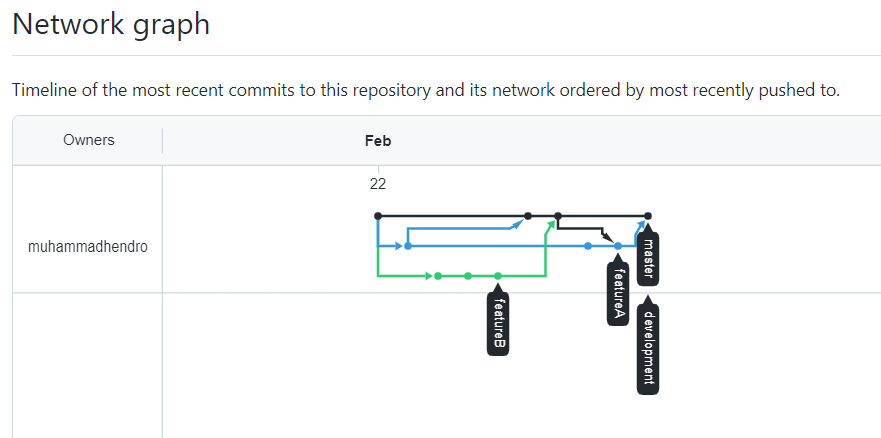
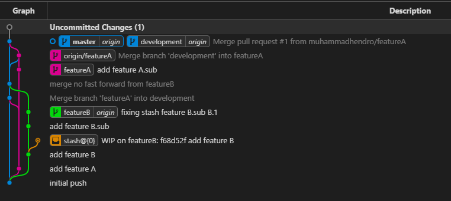

# (2) Version Control and Branch Management (Git)

## Resume
Dalam materi ini, mempelajari:
1. Penggunaan Git (VCS)
2. Penggunaan branch, checkout, add, commit, push, fetch, pull, stash, merge

### GIT
Merupakan VCS untuk mencatat perubahan semua file dalam sebuah project, dan digunakan untuk mengembangkan software bersama.

melakukan remote repository untuk menyimpan project ke github
```
git init
git remote add origin https://github.com/muhammadhendro/java_m-hendro-junawarko.git

```

git push untuk melakukan perubahan file ke remote repository
```
git add .
git commit -m "initial commit"
git push origin master
```

git stash untuk menyimpan perubahan tanpa membuat commit
```
git stash
git stash apply
```

git merge untuk melakukan penggabungan sebuah branch
```
git merge development
```
merge fast forward dan no fast forward

```
git merge --ff development
git merge --no-ff development
```

## Task
### 1. Membuat Git Repository
Pada task ini, mengimplementasikan penggunaan branch development, featureA, featureB, dan menangani conflict dalam melakukan merge

output:






