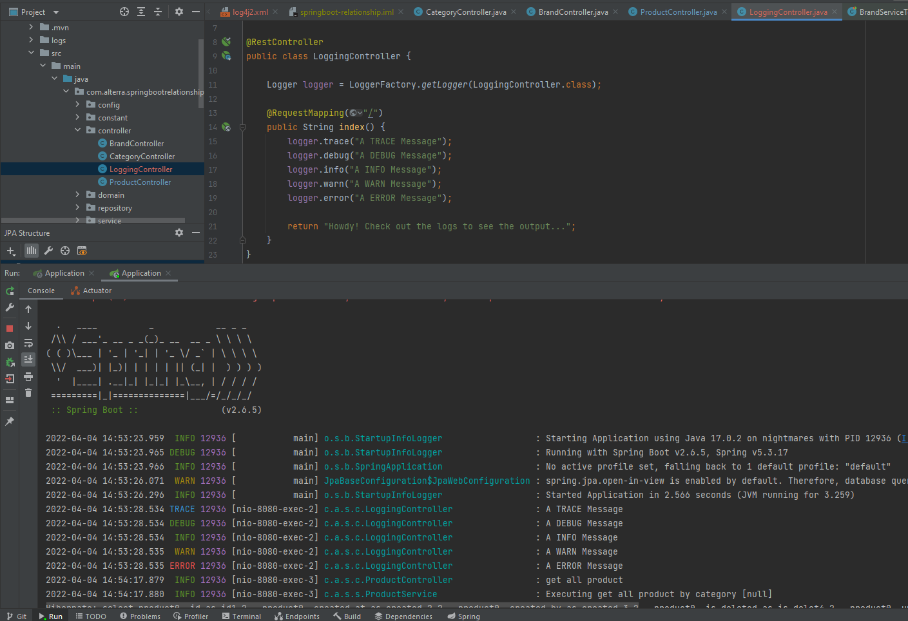

# (30) Logging in Spring Boot

## Resume
Dalam materi ini, mempelajari:
1. Logging
2. Logging in Spring Boot


### Logging
Merupakan proses mengumpulkan dan menyimpan data selama periode waktu tertentu untuk menganalisis tren tertentu atau merekam peristiwa/tindakan berbasis data dari suatu sistem, jaringan atau environment IT

### Benefits Using Logging
- Resource management
- Application troubleshooting
- Regulator compliance
- Bussiness analytics
- Marketing insights

#### Logging Dependencies
```
<dependency>
    <groupId>org.springframework.boot</groupId>
    <artifactId>spring-boot-starter-web</artifactId>
    <exclusions>
        <exclusion>
            <groupId>org.springframework.boot</groupId>
            <artifactId>spring-boot-starter-logging</artifactId>
        </exclusion>
    </exclusions>
</dependency>
<dependency>
    <groupId>org.springframework.boot</groupId>
    <artifactId>spring-boot-starter-log4j2</artifactId>
</dependency>
```

#### Configurations
```
mvn spring-boot:run -Dspring-boot.run.arguments=--logging.level.org.springframework=TRACE,--logging.level.com.alterra=TRACE
```

#### Logging in Spring
```java
@RestController
public class LoggingController {

    Logger logger = LoggerFactory.getLogger(LoggingController.class);

    @RequestMapping("/")
    public String index() {
        logger.trace("A TRACE Message");
        logger.debug("A DEBUG Message");
        logger.info("A INFO Message");
        logger.warn("A WARN Message");
        logger.error("A ERROR Message");

        return "Howdy! Check out the logs to see the output...";
    }
}
```

#### Log Levels
- FATAL -> Red
- ERROR -> Red
- WARN -> Yellow
- INFO -> Green
- DEBUG -> Green
- TRACE -> Green

#### Log Customizing
```xml
<?xml version="1.0" encoding="UTF-8"?>
<configuration>

    <property name="LOGS" value="./logs" />

    <appender name="Console"
        class="ch.qos.logback.core.ConsoleAppender">
        <layout class="ch.qos.logback.classic.PatternLayout">
            <Pattern>
                %black(%d{ISO8601}) %highlight(%-5level) [%blue(%t)] %yellow(%C{1.}): %msg%n%throwable
            </Pattern>
        </layout>
    </appender>

    <appender name="RollingFile"
        class="ch.qos.logback.core.rolling.RollingFileAppender">
        <file>${LOGS}/spring-boot-logger.log</file>
        <encoder
            class="ch.qos.logback.classic.encoder.PatternLayoutEncoder">
            <Pattern>%d %p %C{1.} [%t] %m%n</Pattern>
        </encoder>

        <rollingPolicy
            class="ch.qos.logback.core.rolling.TimeBasedRollingPolicy">
            <!-- rollover daily and when the file reaches 10 MegaBytes -->
            <fileNamePattern>${LOGS}/archived/spring-boot-logger-%d{yyyy-MM-dd}.%i.log
            </fileNamePattern>
            <timeBasedFileNamingAndTriggeringPolicy
                class="ch.qos.logback.core.rolling.SizeAndTimeBasedFNATP">
                <maxFileSize>10MB</maxFileSize>
            </timeBasedFileNamingAndTriggeringPolicy>
        </rollingPolicy>
    </appender>
    
    <!-- LOG everything at INFO level -->
    <root level="info">
        <appender-ref ref="RollingFile" />
        <appender-ref ref="Console" />
    </root>

    <!-- LOG "com.baeldung*" at TRACE level -->
    <logger name="com.baeldung" level="trace" additivity="false">
        <appender-ref ref="RollingFile" />
        <appender-ref ref="Console" />
    </logger>

</configuration>
```

## Task
### 1. Challenge 1
Pada task ini, mengimplementasikan logging output pada aplikasi CRUD

[Praktikum](./praktikum/alterra_unit-test)

output:




