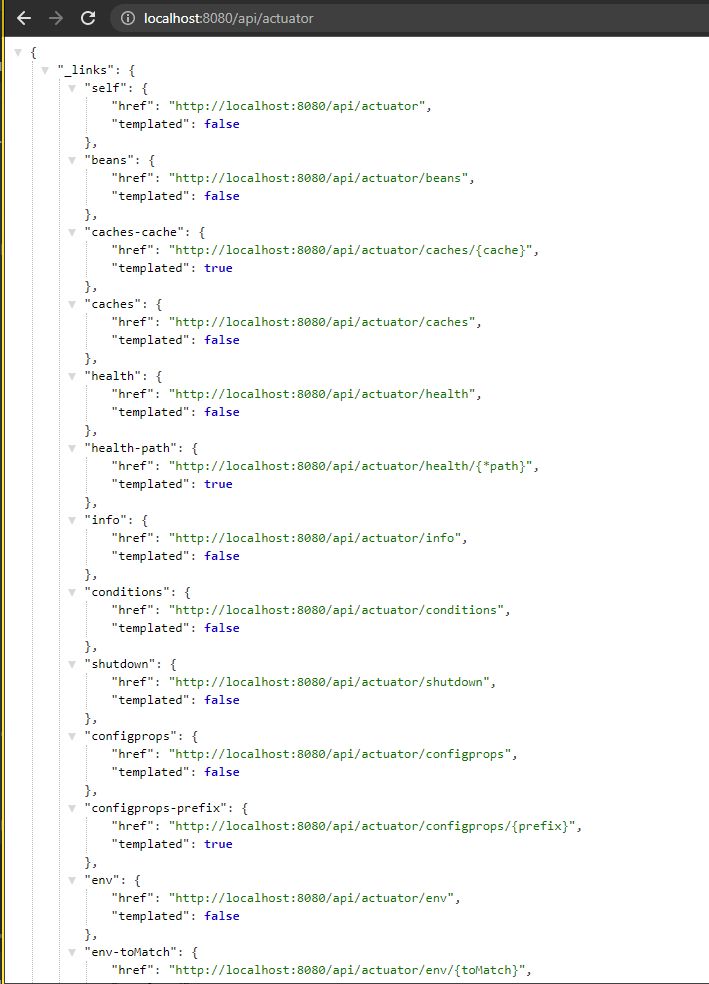

# (31) Spring Boot Actuator 

## Resume
Dalam materi ini, mempelajari:
1. Environment Development
2. Development Stages
3. Testing Stages
4. Production Stages
5. Spring Actuator

### Environment Development
Merupakan Environment yang mengotomatiskan atau menambah rutinitas yang terlibat dalam siklus pengembangan perangkat lunak
- Development
- Testing
- Staging
- Production

#### Benefit Using Environment
- Easy for managing feature when before released on production.
- Prevent many bugs
- Deliver high quality software
- Smooth switching environtments


### Development Stages
- Planning
- Analysis
- Design
- Coding/Implementation
- Testing
- Patching/Maintenance

### Testing Stages
- Unit testing / Integration testing
- Functional testing
- Regression testing
- Smoke testing
- User acceptance testing

#### Spring Actuator Dependencies
```xml
<dependency>
	<groupId>org.springframework.boot</groupId>
	<artifactId>spring-boot-starter-actuator</artifactId>
	<version>2.6.6</version>
</dependency>
```

#### Spring Actuator Config
```
management.security.enabled=false
management.endpoint.shutdown.enabled=true
management.endpoints.web.exposure.include=*
```

## Task
### 1. Problem 1
Pada task ini, mengimplementasikan actuator pada spring boot untuk monitoring aplikasi.

[Praktikum](./praktikum/alterra_actuator)


actuator output:



health output:


