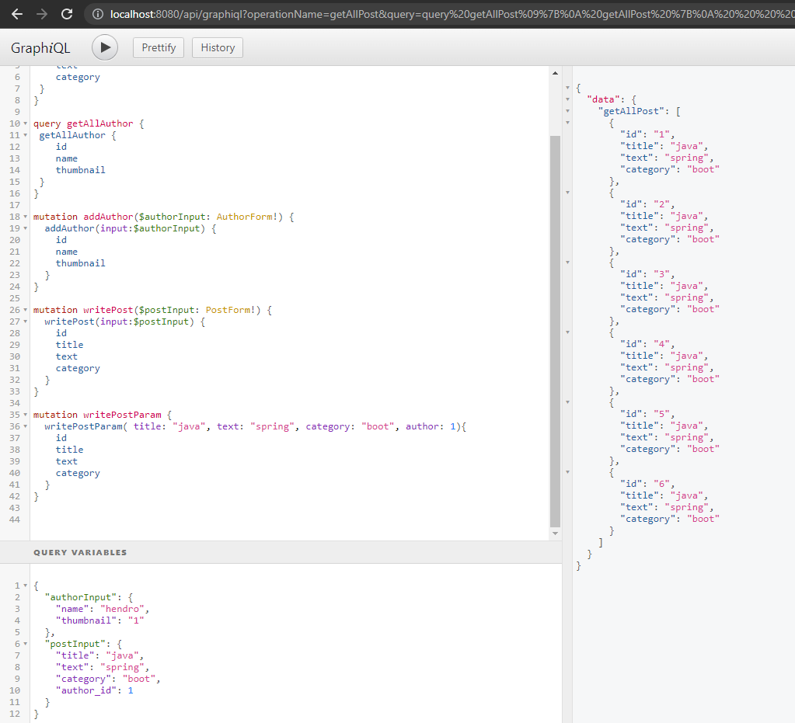

# (36) Graph QL with Spring Boot

## Resume
Dalam materi ini, mempelajari:
1. GraphQL


### GraphQL
GraphQL adalah sebuah query untuk API dan runtime untuk memenuhi query tersebut dengan data yang ada, dengan deskripsi data yang lengkap dan mudah dimengerti.

#### GraphQL vs RESTful API
- Data Fetching with REST vs GraphQL
- No more Over- and Underfetching 
- Overfetching: Downloading superfluous data 
- Rapid Product Iterations on the Frontend 
- Insightful Analytics on the Backend
- Benefits of a Schema & Type System

#### GraphQL Query
```
type Query {
    me: User
}

type User {
    id: ID
    name: String
}
```
```
function Query_me(request) {
    return request.auth.user;
}

function User_name(user) {
    return user.getName();
}
```
```
{
    me {
        name
    }
}
```

#### Dependency GraphQL

```
<dependency>
    <groupId>com.graphql-java</groupId>
    <artifactId>graphql-spring-boot-starter</artifactId>
    <version>5.0.2</version>
</dependency>
<dependency>
    <groupId>com.graphql-java</groupId>
    <artifactId>graphql-java-tools</artifactId>
    <version>5.2.4</version>
</dependency>
```

#### Schema Files
```
type Query {
   bookById(id: ID): Book
}

type Book {
    id: ID
    name: String
    pageCount: Int
    author: Author
} 

type Author {
    id: ID
    firstName: String
    lastName: String
} 
```

#### GraphQL Resolver Config
```java
@Component
public class GraphQLProvider {

    private GraphQL graphQL;

    @Bean
    public GraphQL graphQL() {
        return graphQL;
    }

    @PostConstruct
    public void init() throws IOException {
        URL url = Resources.getResource("schema.graphqls");
        String sdl = Resources.toString(url, Charsets.UTF_8); 
        GraphQLSchema graphQLSchema = buildSchema(sdl);
        this.graphQL = GraphQL.newGraphQL(graphQLSchema).build(); 
    }

    private GraphQLSchema buildSchema(String sdl) {
        // TODO: we will create the schema here later
    }
}
```

#### GraphQL Builder Schema Config
```java
@Autowired
GraphQLDataFetchers graphQLDataFetchers;

private GraphQLSchema buildSchema(String sdl) {
    TypeDefinitionRegistry typeRegistry = new SchemaParser().parse(sdl);  
    RuntimeWiring runtimeWiring = buildWiring();
    SchemaGenerator schemaGenerator = new SchemaGenerator();
    return schemaGenerator.makeExecutableSchema(typeRegistry, runtimeWiring);
}

private RuntimeWiring buildWiring() {
    return RuntimeWtring.newRuntimeWiring()
        . type(newTypeWiring("Query")
            .dataFetcher("bookById", graphQLDataFetchers.getBookByIdDataFetcher()))  
        . type(newTypeWiring("Book")
            .dataFetcher("author", graphOLDataFetchers.getAuthorDataFetcher()))
            .build();
}
```

#### GraphQL Data Fetchers
```java
@Component
public class GraphQLDataFetchers {

  private static List<Map<String, String>> books = Arrays.asList(
      ImmutableMap.of("id", "book-1",
         "name", "Harry Potter and the Philosopher's Stone", 
         "pageCount", "223",
         "authorld", "author-1"),
      ImmutableMap.of("id", "book-2", 
         "name", "Moby Dick", 
         "pageCount", "635",
         "authorld", "author-2"), 
      ImmutableMap.of("id", "book-3",
         "name", "Interview with the vampire",
         "pageCount", "371",
         "authorId", "author-3")
  );

  private static List<Map<String, String>> authors = Arrays.asList(
      ImmutableMap.of("id", "author-1", 
         "firstName", "Joanne", 
         "lastName", "Rowling"),
      ImmutableMap.of("id", "author-2", 
         "firstName", "Herman", 
         "lastName", "Melville"),
      ImmutableMap.of("id", "author-3", 
         "firstName", "Anne",
         "lastName", "Rice")
  );
```

```java
public DataFetcher getBookByIdDataFetcher() {
    return dataFetchingEnvironment -> {
     String bookId = dataFetchingEnvironment.getArgument("id"); 
     return books
         .stream()
         .filter(book -> book.get("id").equals(bookId)) 
         .findFirst()
         .orElse(null);
     };
}

  public DataFetcher getAuthorDataFetcher() {
    return dataFetchingEnvironment -> {
     Map<String,String> book = dataFetchingEnvironment.getSource();
     String authorld = book.get("authorId");
     return authors
         .stream()
         .filter(author -> author.get("id").equals(authorId)) 
         .findFirst()
         .orElse(null);
    };
}
```


## Task
### 1. Challenge 1
Pada task ini, mengimplementasikan GraphQL dari schema 

[Praktikum](./praktikum/graphql)

output:




