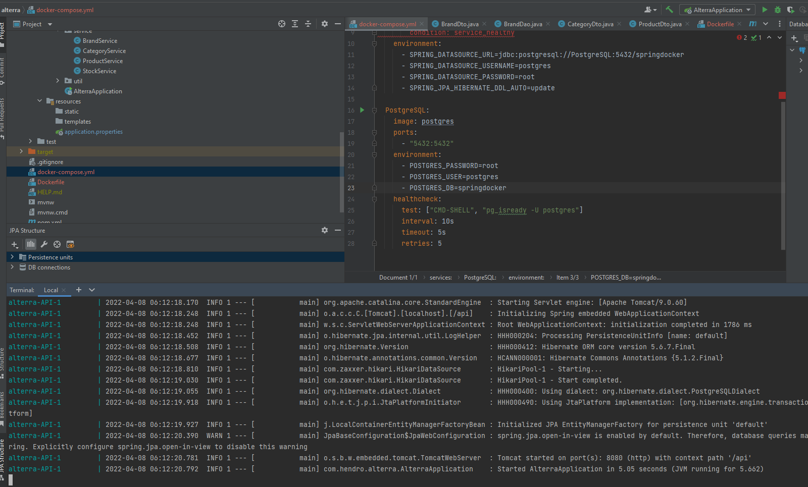

# (37) Docker Container with Microservices 

## Resume
Dalam materi ini, mempelajari:
1. Docker


### Docker
Docker adalah platform perangkat lunak yang memungkinkan Anda membuat, menguji, dan menerapkan aplikasi dengan cepat.

### Docker Benefits
- Portability
- Performance
- Agility
- Isolation
- Scalability

### Docker Concepts
- Dockerfile
- Docker Images
- Docker Container
- Docker Hub
- Docker Daemon
- Docker Engine
- Docker Registry
- Docker Compose
- Docker Swarm

### Docker Command


### Build Images Spring
```
FROM openjdk:8-jdk-alpine
ARG JAR_FILE=target/*.jar
COPY ${JAR_FILE} app.jar
EXPOSE 8080
ENTRYPOINT ["java", "-jar", "/app,jar"]
```
```
docker build -t spring-boot .
```

### Run Images Spring
```
docker run --rm -p 8080:8080 spring-boot
```


## Task
### 1. Challenge 1
Pada task ini, mengimplementasikan project spring boot menggunakan docker.

[Praktikum](./praktikum/alterra)

Dockerfile
```
FROM openjdk:17-jdk-alpine
ARG JAR_FILE=target/*.jar
COPY ${JAR_FILE} app.jar
ENTRYPOINT ["java","-jar","/app.jar"]
```
docker-compose.yml
```yml
version: '3.1'
services:
  API:
    image: 'spring-boot'
    ports:
      - "8080:8080"
    depends_on:
      PostgreSQL:
        condition: service_healthy
    environment:
      - SPRING_DATASOURCE_URL=jdbc:postgresql://PostgreSQL:5432/springdocker
      - SPRING_DATASOURCE_USERNAME=postgres
      - SPRING_DATASOURCE_PASSWORD=root
      - SPRING_JPA_HIBERNATE_DDL_AUTO=update

  PostgreSQL:
    image: postgres
    ports:
      - "5432:5432"
    environment:
      - POSTGRES_PASSWORD=root
      - POSTGRES_USER=postgres
      - POSTGRES_DB=springdocker
    healthcheck:
      test: ["CMD-SHELL", "pg_isready -U postgres"]
      interval: 10s
      timeout: 5s
      retries: 5
```
output:




