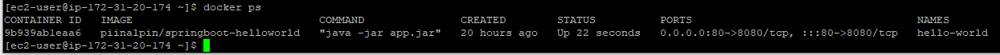

# (38) Compute Service

## Resume
Dalam materi ini, mempelajari:
1. CI/CD
2. Automatic Deployment
3. Github Actions


### CI/CD
CI adalah proses pengujian dan pembuatan software secara otomatis setelah kode aplikasi yang baru terintegrasi ke dalam repository (tempat penyimpanan) bersama. Sedangkan CD adalah proses penyampaian aplikasi yang dibuat dalam proses CI ke bagian lingkungan produksi, yang dimasukkan melalui automated test.

### CI/CD Benefits
1. Increased speed of innovation and ability to compete in 
the marketplace
2. Code in production is making money instead of sitting in 
a queue waiting to be deployed
3. Great ability to attract and retain talent
4. Higher quality code and operations due to 
specialization

### Automatic Deployment
praktik yang memungkinkan Anda mengirimkan kode secara penuh atau semi-otomatis di beberapa tahap proses pengembangan - mulai dari pengembangan awal hingga produksi.

### Automatic Deployment Benefits
- Reduced Possibility of errors
- Saving time
- Consistency and repeatability

### Github Actions Example
```yaml
name: GitHub Actions Demo
on: [push]
jobs:
  Explore-GitHub-Actions:
    runs-on: ubuntu-latest
    steps:
      - run: echo "🎉 The job was automatically triggered by a ${{ github.event_name }} event."
      - run: echo "🐧 This job is now running on a ${{ runner.os }} server hosted by GitHub!"
      - run: echo "🔎 The name of your branch is ${{ github.ref }} and your repository is ${{ github.repository }}."
      - name: Check out repository code
        uses: actions/checkout@v3
      - run: echo "💡 The ${{ github.repository }} repository has been cloned to the runner."
      - run: echo "🖥️ The workflow is now ready to test your code on the runner."
      - name: List files in the repository
        run: |
          ls ${{ github.workspace }}
      - run: echo "🍏 This job's status is ${{ job.status }}."
```

### Github Actions Spring
```yaml
name: Cl/CD Pipeline 
on:
 #Manually trigger workflow runs
 workflow dispatch:
 #Trigger the workflow on push from the main branch
 push:
   branches:
     - main
jobs:
 #Test's job
 tests:
   name: Untt tests
   #Run on Ubuntu using the latest version
   runs-on: ubuntu-latest
   #Job's steps
   Steps:
     #Check-out your repository under $GITHUB_WORKSPACE, so your workflow can access it
     - uses: actions/checkout@v1
     #Set up JDK 11
     - name: Set up JDK
       uses: actions/setup-java@v1
       with:
        java-version: '11'
     #Set up Maven cache
     - name: Cache Maven packages
       #This action allows cachtng dependencies and build outputs to improve workflow execution time. 
       uses: acttons/cacheevl
       with:
        path: ~/.m2
        key: ${{ runner.os }}-m2-${{ hashFiles(1**/pom.xmll 
        restore-keys: ${{ runner.os }}-m2
     #Run Tests
     - name: Run Tests
       run: mvn -B test

```


## Task
### 1. Problem 1
Pada task ini, mendeploy spring boot project ke AWS

[Praktikum](./praktikum/alterra)

output:




