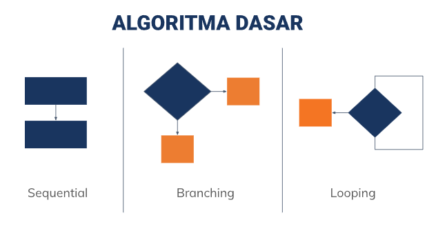
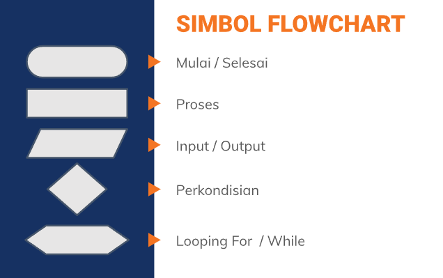
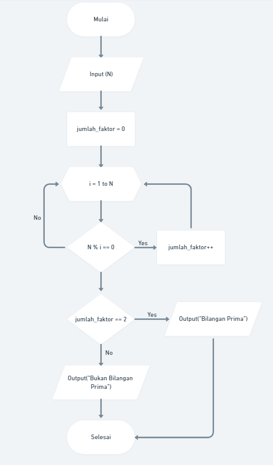
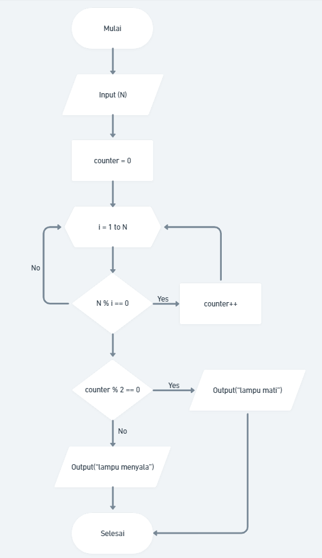

# (3) Introduction Algorithm

## Resume
Dalam materi ini, mempelajari:
1. Pengertian Algoritma
2. Karakteristik Algoritma
3. Algoritma Dasar
4. Pseudocode
5. Flowchart

### Algoritma
Merupakan langkah-langkah prosedur yang didefinisikan dengan baik untuk menyelesaikan suatu masalah dengan mengambil beberapa nilai sebagai **input** dan menghasilkan beberapa nilai sebagai **output**.

### Karakteristik Algoritma
- Memiliki batas (awal & akhir)
- Intruksi terdefinisi dengan baik
- Efektif dan Efisien

### Algoritma Dasar

### Pseudocode
Dapat diartikan sebagai deskripsi dari algoritma pemrograman yang dituliskan secara sederhana dibandingkan dengan sintaksis bahasa pemrograman. Agar lebih mudah dibaca dan dipahami manusia

### Flowchart
Merupakan suatu bagan atau simbol tertentu yang menggambarkan urutan dan hubungan suatu proses secara mendetail.

## Task
### 1. Membuat Flowchart dari suatu kasus
Pada task ini, mengimplementasikan algoritma ke dalam flowchart

Problem 1 Bilangan Prima:\
[Link Whimsical](https://whimsical.com/section3-1-2GPqoU1sVgNXKoEQ8ViMxS)\
output:\

Problem 2 Lampu & Tombol:\
[Link Whimsical](https://whimsical.com/section3-2-4PydBhrukWBrr79AYNP6vz)\
output:\

