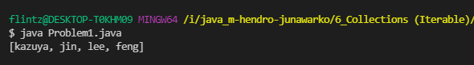
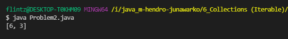
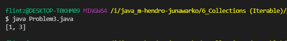
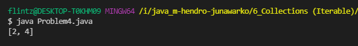
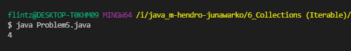

# (6) Collections Iterable & Map

## Resume
Dalam materi ini, mempelajari:
1. Iterable
2. Collection
3. List
4. Set
5. SortedSet
6. Queue
7. Deque
8. Map
9. Sorted Map
10. Navigable Map


### Iterable
Merupakan struktur data yang dapat dilakukan perulangan pada data
```
public static void main(String[] args) {
        Iterable<String> names = List.of("Alterra", "Academy");
        for (String name : names) {
            System.out.println(name);
        }

    }
}
```


#### Iterator
merupakan class yang memanage iterasi dari sebuah iterable, dan mengelola bagian iterasi
```
public static void main(String[] args) {
        Iterable<String> names = List.of("Alterra", "Academy");
        Iterator<String> it = names.iterator();
        while (it.hasNext()) {
            String i = it.next();
            System.out.println(i);
        }

    }
```
### Collection
Merupakan kumpulan dari object/data yang diletakan dalam satu tempat yang sama.
```
public static void main(String[] args) {
        Collection<String> names = new ArrayList<>();
        names.add("Alterra");
        names.add("Academy");
        names.remove("Academy");
        System.out.println(names.contains("Alterra"));

    }
```
### List
List merupakan sebuah interface untuk menyimpan data secara linear, merupakan turunan interface collection dan dapat memasukan nilai yang sama, urutan data pertama dimasukan berada pada urutan pertama dan berikutnya.

#### Array List
Menyediakan penyimpanan data yang dinamis, yaitu tidak terikat dengan kapasitas data yang disimpan
```
public static void main(String[] args) {
        List<Integer> umur = new ArrayList<>();
        umur.add(17);
        umur.add(60);
        umur.add(30);
        System.out.println(umur.get(2));

    }
```
#### Linked List
Merupakan struktur data yang menyimpan setiap elemennya terhubung satu sama lain, dan menyimpan alamat memory masing-masing elemen
```
public static void main(String[] args) {
        List<Integer> umur = new LinkedList<>();
        umur.add(17);
        umur.add(60);
        umur.add(30);
        System.out.println(umur.get(2));

    }
```
#### Immutable List
Merupakan bagian dari list tapi tidak dapat dirubah datanya.
```
public static void main(String[] args) {
        List<Integer> umur = new LinkedList<>();
        var umurImmutable = Collections.unmodifiableList(umur);
        umurImmutable.add(2);
        umur.add(17);
        umur.add(60);
        umur.add(30);
        System.out.println(umur.get(2));

    }
```
#### Stack
Stack menyimpan data secara linear, tetapi proses penambahan dan pengambilan data menggunakan LIFO, artinya data yang baru dimasukan maka dikeluarkan terlebih dahulu, mempunyai method **push** (menambah data) dan **pop** (mengambil data).
```
public static void main(String[] args) {
        Stack<Integer> umur = new Stack<>();
        umur.push(7);
        umur.push(10);
        System.out.println(umur.pop());

    }
```
### Set
Merupakan struktur data yang menyimpan data secara linear, tapi tidak dapat menerima data yang duplikat.
#### Hash Set
Sebagai Struktur data yang menyediakan cara tercepat untuk proses pencarian data.
```
public static void main(String[] args) {
        Set<Integer> umur = new HashSet<>();
        umur.add(3);
        umur.add(3);
        umur.add(4);
        umur.add(2);
        System.out.println(umur);

    }
```
#### LinkedHashSet
Pada data yang diinput lebih dahulu akan terdapat pada urutan paling depan.
```
public static void main(String[] args) {
        Set<Integer> umur = new LinkedHashSet<>();
        umur.add(3);
        umur.add(3);
        umur.add(4);
        umur.add(2);
        System.out.println(umur);

    }
```
#### Enum Set
Digunakan untuk menyimpan nilai enum dan urutan mengikuti dari penulisan data.
```
enum months {
        JANUARY, FEBRUARY, MARCH, APRIL, MAY, JUNE, JULY, AUGUST, SEPTEMBER, OCTOBER, NOVEMBER, DECEMBER
    }

    public static void main(String[] args) {
        Set<months> set = EnumSet.allOf(months.class);
        Iterator<months> iter = set.iterator();
        while (iter.hasNext())
            System.out.println(iter.next());

    }
```
### SortedSet
Set yang dapat mengelola urutan dari sebuah data.
#### TreeSet
```
public static void main(String[] args) {
        SortedSet<Integer> umur = new TreeSet<>();
        umur.add(3);
        umur.add(3);
        umur.add(4);
        umur.add(2);
        System.out.println(umur);
    }
```
#### NavigableSet
```
public static void main(String[] args) {
        NavigableSet<Integer> umur = new TreeSet<>();
        NavigableSet<Integer> umurDesc = umur.descendingSet();
        umur.add(3);
        umur.add(3);
        umur.add(4);
        umur.add(2);
        System.out.println(umurDesc);
    }
```
### Queue
Queue mengimplementasi FIFO, artinya data yang lebih dahulu dimasukkan akan lebih dahulu diambil.
```
public static void main(String[] args) {
        Queue<Integer> umur = new PriorityQueue<>();
        umur.add(7);
        umur.add(10);
        umur.add(5);
        System.out.println(umur.poll());
    }
```
### Deque
Merupakan sebuah queue yang memiliki dua ujung insertion dan deletion
```
public static void main(String[] args) {
        Deque<String> bulan = new LinkedList<>();
        bulan.offerLast("1");
        bulan.offerLast("2");
        bulan.offerLast("3");
        System.out.println(bulan.pollLast());
    }
```
### Map
Merupakan struktur data yang dapat digunakan untuk menyimpan data dan mempunyai **key** dan **value**

#### HashMap
```
public static void main(String[] args) {
        Map<String, Integer> bulan = new HashMap<>();
        bulan.put("Januari", 1);
        bulan.put("Februari", 2);
        bulan.put("Agustus", 8);
        System.out.println(bulan);
    }
```

#### WeakHashMap
```
public static void main(String[] args) {
        Map<String, Integer> bulan = new WeakHashMap<>();
        bulan.put("Januari", 1);
        bulan.put("Februari", 2);
        bulan.put("Agustus", 8);
        System.gc();
        System.out.println(bulan);
    }
```
#### IdentityHashMap
```
public static void main(String[] args) {
        Map<String, Integer> bulan = new IdentityHashMap<>();
        var key = "Januari.Awal";
        var awal = "Awal";
        var key2 = "Januari" + "." + awal;
        bulan.put(key, 1);
        bulan.put(key2, 1);
        bulan.put("Agustus", 8);
        System.gc();

        System.out.println(bulan.size());
    }
```
#### LinkedHashMap
```
 public static void main(String[] args) {
        Map<String, Integer> bulan = new LinkedHashMap<>();
        bulan.put("Januari", 1);
        bulan.put("Februari", 2);
        bulan.put("Agustus", 8);
        System.out.println(bulan);
    }
```
#### ImmutableMap
```
public static void main(String[] args) {
        Map<String, Integer> bulan = Map.of("Januari", 1, "Februari", 2);
        System.out.println(bulan);
    }
```
### Sorted Map
Map yang dapat diurutkan secara ascending dan descending
```
public static void main(String[] args) {
        SortedMap<String, Integer> bulan = new TreeMap<>();
        bulan.put("Januari", 1);
        bulan.put("Februari", 2);
        bulan.put("Agustus", 8);
        
        System.out.println(bulan);
    }
```

### Navigable Map
Termasuk seperti SortedMap tapi dengan method untuk menavigasi yang lebih lengkap.
```
public static void main(String[] args) {
        NavigableMap<String, Integer> bulan = new TreeMap<>();
        bulan.put("Januari", 1);
        bulan.put("Februari", 2);
        bulan.put("Agustus", 8);

        System.out.println(bulan.lowerKey("Februari"));
    }
```


## Task
### 1. Problem 1 - Array Merge 
Pada task ini, menggabungkan 2 array dan tidak terdapat data yang sama.

[Problem 1](./praktikum/Problem1.java)\
output:\


### 2. Problem 2 - Angka Muncul Sekali
Pada task ini, menampilkan angka yang muncul sekali.

[Problem 2](./praktikum/Problem2.java)\
output:\


### 3. Problem 3 - Pair with Target Sum 
Pada task ini, dengan linear complexity tentukan jumlah yang sama dari pasangan array dengan target yang diberikan. tampilkan nilai indexnya.

[Problem 3](./praktikum/Problem3.java)\
output:\


### 4. Problem 4 -  Array Unique
Pada task ini, satu array berupa kumpulan angka di array pertama tetapi tidak memiliki duplikasi di di array kedua

[Problem 4](./praktikum/Problem4.java)\
output:\


### 5. Problem 5 - Remove Duplicates
Pada task ini,  diberikan array dengan array sorted, hapus data duplikat dan kembalikan banyak array yang sudah tidak duplikat

[Problem 5](./praktikum/Problem5.java)\
output:\


### 6. Problem 6 -  Maximum Sum Subarray of Size K (Optional / Nilai Tambah)

Pada task ini, Diberikan array bilangan positif dan bilangan positif 'k', temukan jumlah maksimum dari setiap subarray yang berdekatan berukuran 'k'.

[Problem 6](./praktikum/problem6.java)\
output:\


